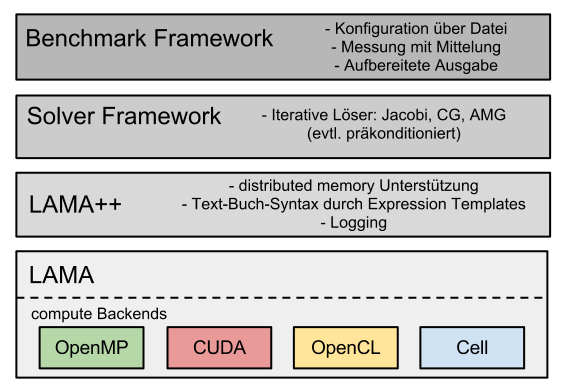

Introduction
============

This documentation will give an overview of the features of the \Library of
\Accelerated \Math \Applications (\L\A\M\A) and will describe the general usage
of these features.

You will find serval short describtions of our basic data structures, their
behaviour as well as simple examples on how to use them.

About LAMA
----------

LAMA is an easy to use open source \Basic \Linear \Algebra \Subprogram (\B\L\A\S)
Library with special focus on large sparse matrices. Its core is written in C++,
so you have the comfort of writting your algorithms in a text-book syntax
because of expressions templates. Within the given backends there are optimized
matrix-vector kernels organized, so you do not have to care about hardware
specific programming (e.g. CUDA). We also care about communicating distributed
data between processes. On top of this we prepare a set of basic linear solvers
as a jacobi or CG method.

Features
--------

The supported features of the actual release are listed below:

- matrix formats

  - Dense
  
  - Sparse
  
    - CSR
    
    - COO
    
    - ELL
    
    - JDS
    
    - DIA
    
- backends

  - CPU (OpenMP optimized)
  
  - GPU
  
    - CUDA
    
- distributions

  - blocked
  
  - cyclic
  
  - blockcyclic (general block)
  
  - general
  
- solvers

  - direct solvers
  
    - inverse solver
    
  - iterative solvers
  
    - jacobi method
    
    - conjugated gradiant (CG) method
    
    - generalized minimal residual (GMRES) method
    
    - simple algebraic multigrid (SAMG) method
    
    - successive over-relaxation (SOR) method

Work in process that you can find in our svn-trunk and that will come with the
next releases are:
 
- OpenCL-Backend

- PGAS support for communication (till now we support MPI)

- ease to use configuration of solver through a DSL

- sparse matrix ordering and partitioning through METIS

- connectivity to OpenFOAM

Additionally to our open source implementation we also support a commercial
version of the AMG method. If you are interested in this, please contact us. 

Use Cases
---------

So, when it's time to use LAMA?

LAMA is the right decision for you, if you are doing linear algebra on sparse
matrices and you want to reach the full performance of your (parallel) machine
without taking care on the kernel code on your own. With LAMA it's easy for you
to write code, that is executable on different heterogeneous machines. 

Possible use cases for LAMA can be found in solving partial elliptic
differential equation (e.g. for ground water flow and oil reservation
simulation), image filtering (blur, gauss filter) and many more.

.. Overview Chart?
   ---------------

Our goals
---------

- easy to use text-book syntax for linear algebra operations
- easy integration of different heterogeneous hardware components, especially GPUs
- high parallelism
- easy extensibility
- hidden complexity of hardware specific programming and communication needs  
