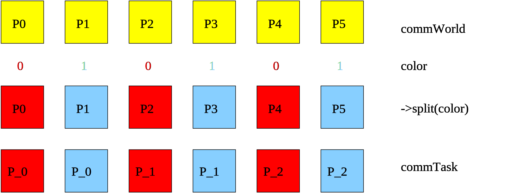

.. _Communicator:

Communicator
============

A communicator provides a set of routines for exchanging non-local data between processors.

Communication with Heterogeneous Arrays
^^^^^^^^^^^^^^^^^^^^^^^^^^^^^^^^^^^^^^^

Here is an example of a high-level communication routine that shifts a heterogeneous array
between neighbored processors.

.. code-block:: c++

   hmemo::HArray<ValueType> recvArray, sendArray;

   sendArray = ...
   int direction = 1;  // shift to right, -1 for shift to left
   comm->shiftArray( recvArray, sendArray, direction );

* The method is a template method for different value types of the array.
* The method must be called by all processors (SPMD mode).

For a complete list of available routines we refer to the Doxygen system documentation.

Derived Classes
^^^^^^^^^^^^^^^

* NoCommunicator is a dummy class for a single processor.
* MPICommunicator uses MPI for the implementation of the communication routines.

Communicator Factory
^^^^^^^^^^^^^^^^^^^^

.. code-block:: c++

   CommunicatorPtr mpiComm = Communicator::getCommunicatorPtr( Communicator::MPI );

Communicator Splitting
^^^^^^^^^^^^^^^^^^^^^^

Most applications might work well with the default communicator that uses
all available processors. In some situations it might be useful to work only on
a subset of processors.
Therefore it is possible to split up a communicator into sub-communicators by a
color argument.

.. code-block:: c++

   CommunicatorPtr commWorld = Communicator::getCommunicatorPtr();
   PartitionId color = commWorld->getRank() % 2; 
   CommunicatorPtr commTask = commWorld->split( color );

All processors with the same color will build a new communicator. 

    Splitting a communicator into sub-communicators.

After the processors are divided up into subgroups with a new communicator,
the macro ``SCAI_DMEMO_TASK`` should be used to set this communicator as
the actual communicator within the actual scope.

.. code-block:: c++

    {
        // commTask becomes new default communicator

        SCAI_DMEMO_TASK( commTask )

        auto dist = std::make_shared<BlockDistribution>( N ); 
        ...
    }

