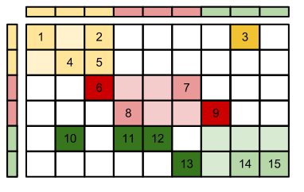
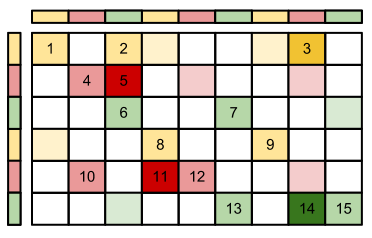

.. _Distribution:

Distributions
=============

LAMA is provided to work on distributed systems from PC clusters to supercomputers. Communication between the processes
is handled by a given library LAMA is build with ( to now: a given MPI implementation, e.g. openMPI, mvapich, ...; a
PGAS backend is in progress). Data management for the communication is operated internally. 

Data distribution is done line-by-line. So one process always holds a full row of a matrix. Additionally a matrix has a
column distribution which divide the partial matrix of one process in a **local** and **halo** part. Regarding the
matrix-vector-multiplication with a vector having the column distribution of the matrix, the local part of the matrix
can be processed without communication of the vector parts on other processes, while the halo part can not be processed
before communication.
Internally these two parts are stored autonomous in two storages, so the calculation can be executed independently and
the communication can be executed asynchronously to the calculation on the local part. 

.. _dmemo-distributions:

Distribution Types
------------------

LAMA provides five distributions types yet.

Block Distribution
^^^^^^^^^^^^^^^^^^

The *BlockDistribution* creates continuous blocks of the same size (except from the last block), which are successivly
assigned to the processes.

    
You create a BlockDistribution by just passing the global distribution size and a communicator:

.. code-block:: c++

   CommunicatorPtr comm( Communicator::getCommunicator( scai::lama::communicator::MPI ) );
   
   DistributionPtr block( new BlockDistribution( numRows, comm ) );

Cyclic Distribution
^^^^^^^^^^^^^^^^^^^

The *CyclicDistribution* creates stripes of the given chunk size and assigns them consistently.

You create a CyclicDistribution with the shown chunk size of '1' this way:
    
.. code-block:: c++

   DistributionPtr cyclic( new CyclicDistribution( numRows, 1, comm ) );

General Block Distribution
^^^^^^^^^^^^^^^^^^^^^^^^^^

The *GenBlockDistribution* create blocks of the given sizes and assigns them successivly to the processes. The sum of
the sizes have to match the global size.

The following example creates with three parts of size 1, 3 and 2 rows/columns:

.. code-block:: c++

   std::vector<IndexType> localSizes;
   int sizes[] = { 1, 3, 2 };
   localSizes.assign( sizes, sizes + 3 );
   DistributionPtr genBlock( new GenBlockDistribution( numRows, localSizes, comm ) );

GeneralDistribution
^^^^^^^^^^^^^^^^^^^

With the *GeneralDistribution* a fully free Distribution can be created. Therefor, a vector with the mapping from row to
partition is given to the distribution. The number of partitions starts by zero. 

.. code-block:: c++

   std::vector<IndexType> row2part;
   int dist[] = { 1, 2, 0, 2, 0, 1};
   row2part.assign( dist, dist + 6 );
   DistributionPtr gen( new GeneralDistribution( row2part, numRows, comm ) );
   
In this example process 0 has row/column 3 and 5, process 1 row/column 1 and 6 and process 2 row/column.

An alternative is that each process assigns the global indices of his partition (for process 0):

.. code-block:: c++

    std::vector<IndexType> myIndices;
    int indices[] = { 3, 5 };
    myIndices.assign( dist, dist + 2 );
    DistributionPtr gen2( new GeneralDistribution( numRows, myIndices, comm ) );
    
No Distribution
^^^^^^^^^^^^^^^

Since there are cases you need to assign a *DistributionPtr* to a constructor or function, but you do not want to
distribute the data (in one direction) you have the possibility to create a *NoDistribution*. It invokes that there is
no distribution of the data and all processes have a local copy.

.. code-block:: c++

   DistributionPtr no( new NoDistribution ( numRows ) );

Comparison of Distributions
---------------------------

Usually, many data structures will be distributed among the available processors, e.g. two vectors might be distributed.
For the implementation of operations on these distributed data structures, it is important to know whether two data
structures have the same distribution, as in such a case many operations can be implemented without any 
communication at all.

.. code-block:: c++

   DistributionPtr d1( new GenBlockDistribution ( n ) );
   DistributionPtr d2( new GenBlockDistribution ( n ) );

   ...

   if ( *d1 == *d2 )
   {
      // implement the operation on the local parts
      ....
   } 
   else
   {
       COMMON_THROWEXCEPTION( "Operation not available, different distributions" )
   }
