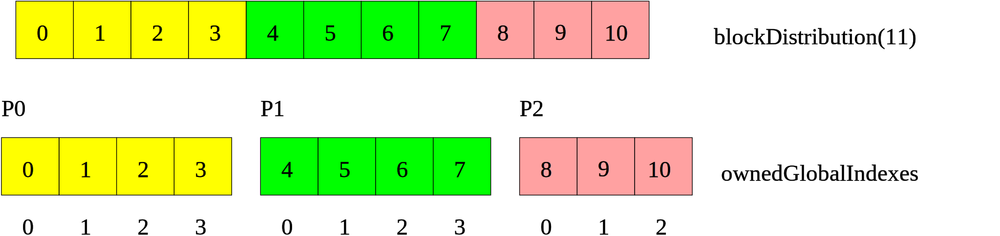
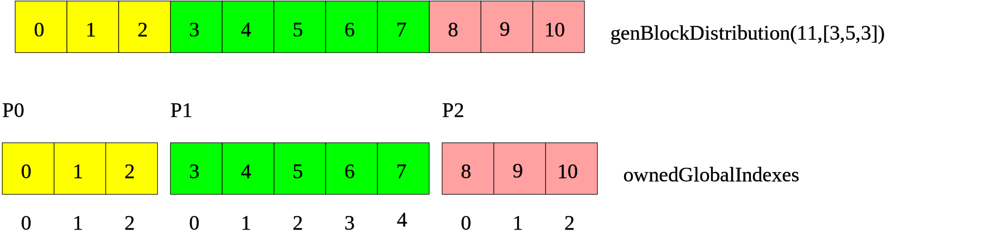
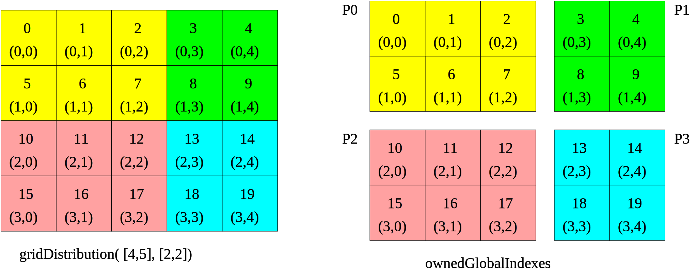

.. _Distribution:

Distributions
=============

LAMA is provided to work on distributed systems from PC clusters to supercomputers. Communication between the processes
is handled by a given library LAMA is build with ( to now: a given MPI implementation, e.g. openMPI, mvapich, ...; a
PGAS backend is in progress). Data management for the communication is operated internally. 

Data distribution is done line-by-line. So one process always holds a full row of a matrix. Additionally a matrix has a
column distribution which divide the partial matrix of one process in a **local** and **halo** part. Regarding the
matrix-vector-multiplication with a vector having the column distribution of the matrix, the local part of the matrix
can be processed without communication of the vector parts on other processes, while the halo part can not be processed
before communication.
Internally these two parts are stored autonomous in two storages, so the calculation can be executed independently and
the communication can be executed asynchronously to the calculation on the local part. 

.. _dmemo-distributions:

Distribution Types
------------------

Up to now, LAMA provides the following distribution classes.

Block Distribution
^^^^^^^^^^^^^^^^^^

The *BlockDistribution* creates continuous blocks of the same size (except from the last block), which are successively
assigned to the processes.

  
    Block distribution of 11 elements onto 3 processors (block size is 4).
    
You create a BlockDistribution by just passing the global distribution size and a communicator:

.. code-block:: c++

   CommunicatorPtr comm( Communicator::getCommunicator( scai::lama::communicator::MPI ) );
   
   DistributionPtr block( new BlockDistribution( N, comm ) );

Cyclic Distribution
^^^^^^^^^^^^^^^^^^^

The *CyclicDistribution* creates stripes of the given chunk size and assigns them consistently.

    Cyclic(2) distribution of 11 elements onto 3 processors.

You create a CyclicDistribution with the shown chunk size of '2' this way:
    
.. code-block:: c++

   DistributionPtr cyclic( new CyclicDistribution( N, 2, comm ) );

General Block Distribution
^^^^^^^^^^^^^^^^^^^^^^^^^^

The *GenBlockDistribution* create blocks of the given sizes and assigns them successivly to the processes. The sum of
the sizes have to match the global size.

The following example creates with three parts of size 1, 3 and 2 rows/columns:

.. code-block:: c++

   IndexType raw_sizes[] = { 3, 5, 3 };
   HArray<IndexType> sizes( 3, raw_sizes );
   DistributionPtr genBlock( new GenBlockDistribution( N, rawSizes, comm ) );

    General block distribution of 11 elements onto 3 processors with sizes (3, 5, 3)

GeneralDistribution
^^^^^^^^^^^^^^^^^^^

With the *GeneralDistribution* a fully free Distribution can be created. Therefore, a vector with the mapping from index to
partition is given to the distribution. The number of partitions starts by zero. 

.. code-block:: c++

   HArray<PartitionId> mapping( { 1, 2, 0, 1, 0, 0, 2, 2, 1, 1, 1 } );  // 11 entries
   DistributionPtr gen( new GeneralDistribution( mapping, comm ) );
   
In this example process 0 owns index 2, 4, and 5, process 1 owns 0, 3, 8, 9, and 10 and 
process 2 owns 1, 6, 7.

An alternative constructor uses the individual sets of owned indexes on each processor.

.. code-block:: c++

    IndexType N = 11;

    HArray<IndexType> myIndexes;

    switch ( comm->getRank() ):
    {
        case 0 : myIndexes = HArray<IndexType>( { 2, 4, 5 } ); 
                 break;
        case 1 : myIndexes = HArray<IndexType>( { 0, 3, 8, 9, 10 } );
                 break;
        case 2 : myIndexes = HArray<IndexType>( { 1, 6, 7 } );
                 break;
    }

    auto gen2 = std::make_shared<GeneralDistribution>( N, myIndexes, comm );

For the latter constructor the number of locally owned indexes must sum up to the global size and
each global index must appear exactly once in the local array ``myIndexes`` on a processor. It is not possible
that one element is owned by multiple processors.

    General distribution of 11 elements onto 3 processors.

Compared to the other distributions, general distributions have the big disadvantage that one local processor
does not know the full mapping, i.e. it cannot determine the owner of an abritrary index. Therefore additional
communication is required to determine ownership of elements.

Grid Distribution
^^^^^^^^^^^^^^^^^

A *GridDistribution* stands for a block distribution of an n-dimenisonal grid in multiple dimensions.

.. code-block:: c++

    const IndexType N1 = 5;
    const IndexType N2 = 4;
    Grid globalGrid( N1, N2 );
    Grid procGrid( 2, 2 );
    DistributionPtr gridDist( new GridDistribution( globalGrid, comm, procGrid ) );

Actually, this defines a mapping from the indexes 0 to N1 * N2 - 1 to four processors. The elements of the
grid are assumed to be stored in a row-major order, i.e. ( x, y+1 ) follows directly ( x, y ) and 
there are N2 elements between ( x + 1, y ) and ( x, y ).

The number of processors in the processor grid has to match the size of the communicator, i.e. the number
of processors onto which the application is running. The procGrid argument is optional in the constructor
of a grid distribution. If it is not specified a processor grid is built from the available processors
in such a way that an optimal balancing with smallest boundaries is achieved.

Single Distribution
^^^^^^^^^^^^^^^^^^^

A *SingleDistribution* stands for a mapping of a all data to one single processor, i.e. only one
processor owns all the data.
    
.. code-block:: c++

    const PartitionId p = 2;
    DistributionPtr singleDist( new SingleDistribution( p, comm ) );

No Distribution
^^^^^^^^^^^^^^^

Since there are cases you need to assign a *DistributionPtr* to a constructor or function, but you do not want to
distribute the data (in one direction) you have the possibility to create a *NoDistribution*. It invokes that there is
no distribution of the data and all processes have a local copy.

.. code-block:: c++

   DistributionPtr no( new NoDistribution ( numRows ) );

Regarding distributed memory programming you should keep in mind that not distributed data might either be used
in a private mode where each processor works on individual values or in a global mode, where all processors
have exactly the same values for their incarnation.

Comparison of Distributions
---------------------------

Usually, many data structures will be distributed among the available processors, e.g. two vectors might be distributed.
For the implementation of operations on these distributed data structures, it is important to know whether two data
structures have the same distribution, as in such a case many operations can be implemented without any 
communication at all.

.. code-block:: c++

   DistributionPtr d1( new GenBlockDistribution ( n ) );
   DistributionPtr d2( new GenBlockDistribution ( n ) );

   ...

   if ( *d1 == *d2 )
   {
      // implement the operation on the local parts
      ....
   } 
   else
   {
       COMMON_THROWEXCEPTION( "Operation not available, different distributions" )
   }
