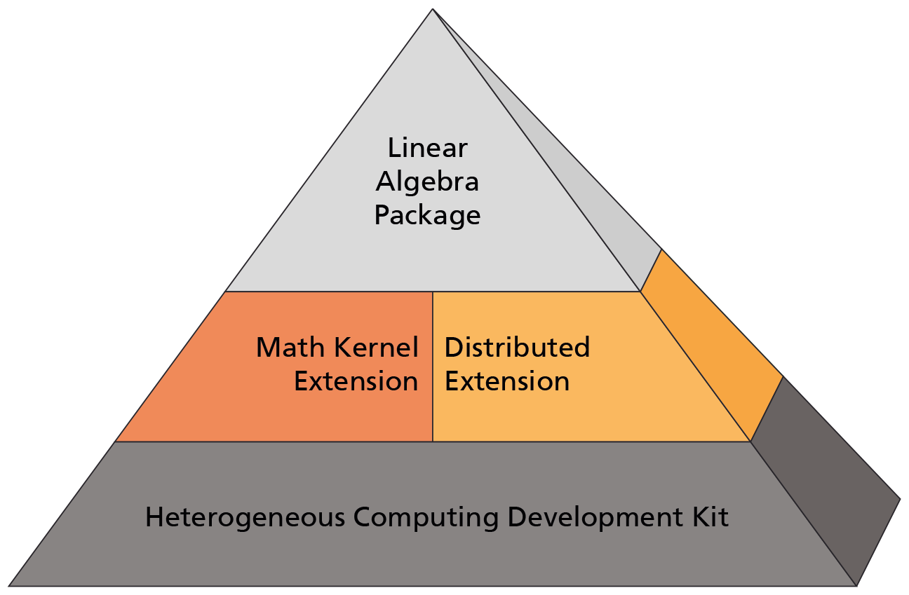

###############
LAMA User Guide
###############

LAMA is a multi-layer framework offering four main modules (see below) for fast heterogeneous software development. 
It targets multi-core CPUs, NVIDIA GPUs and Intel Xeon Phi’s – for single-node or multi-node usage. 
LAMA’s flexible plug-in architecture allows a seamless integration of tomorrow's CPUs and accelerator hardware architectures, thus reducing maintenance costs.

The Heterogeneous Computing Development Kit provides the management of heterogeneous memory and compute kernels. Asynchronous executing is a key capability. The Math Kernel Extension gives uniform access to dense and sparse compute kernels on all platforms while the Distributed Extension supplies full cluster support for scalability on data parallel applications. The Linear Algebra Package enables programming using mathematical notation and provides prepared iterative linear solvers.

In the following you find aninstallation guide, explanation to the modules, and a user documentation for each subproject as well as our beginners tutorial and frequently asked questions.

.. toctree::
   :titlesonly:
   :maxdepth: 1
   
   installation
   modules
   tutorial
   changes
   extension
   faq
