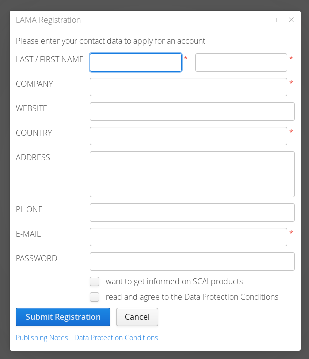
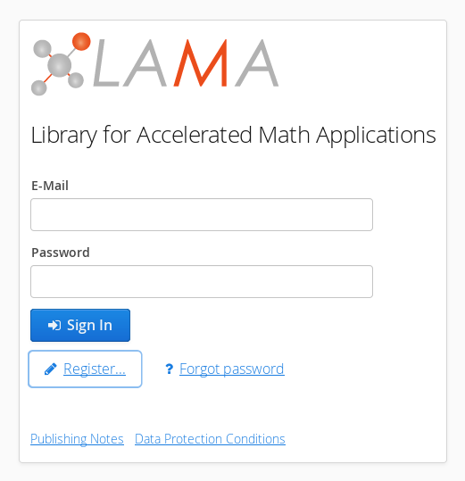
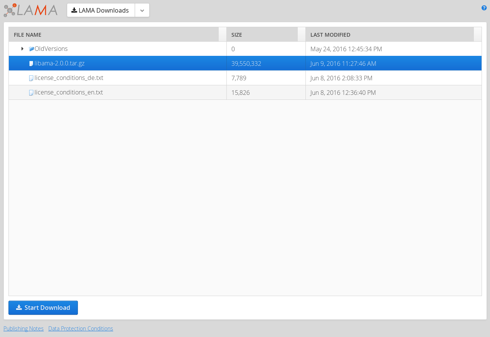

.. _download:

Download
--------

Due to export control it is mandatory to register at our |Portal|. We need information on your name, email, company and country. After the export control check, you receive a confirmation email and get access for downloading a tar ball of a recent releases. If you are interested in ongoing work, please contact us via lama[at]scai.fraunhofer.de and we will check for granting you access to our git repository.

.. |Portal| raw:: html

	<a href="http://www.libama.org/download" target="_blank"> download portal </a>

Registration Process
^^^^^^^^^^^^^^^^^^^^

On the portal web page, please register by filling in all mandatory (*) informations and accept our terms of condition.

Downloading Tar Ball
^^^^^^^^^^^^^^^^^^^^

After confirmation you can login and download a tar ball. Our current release is LAMA 2.0.0.

Just login with your email and passwort (choosen at registration).

For the download select a tar ball (libama-2.0.0.tar.gz is the current one) and start the download:

