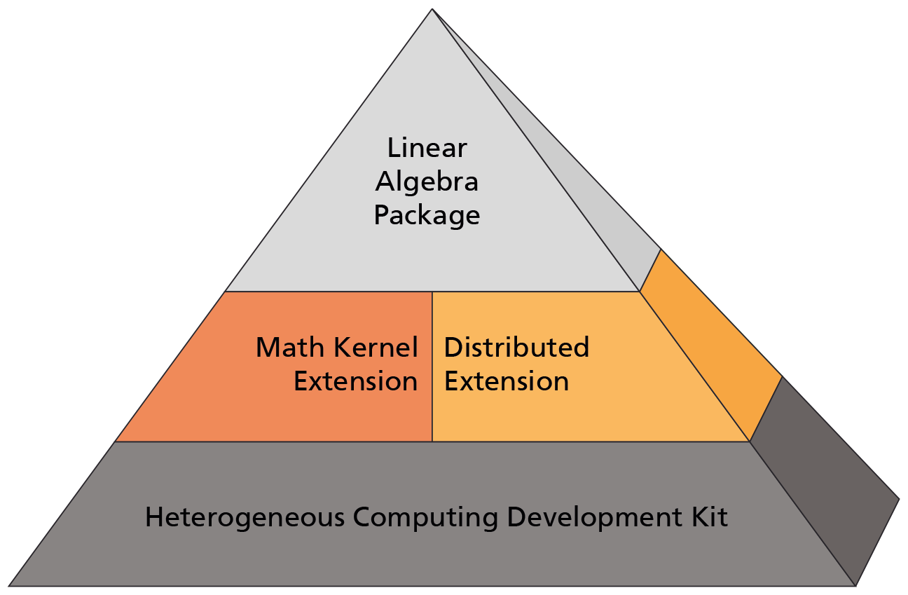

#############
Documentation
#############

.. The \Library of \Accelerated \Math \Applications (\L\A\M\A) is framework for 

********
Contents
********

.. toctree::
   :titlesonly:
   :maxdepth: 1
   
   installation
   projects
   tutorial
   lecture
   faq

.. toctree::
   :hidden:

   introduction
   developer
   benchmarks
   testing

