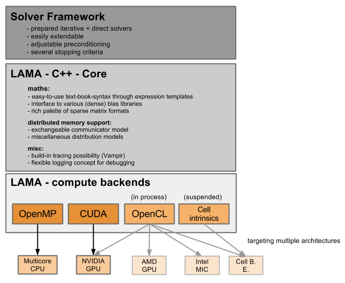

Introduction
============

This documentation will give an overview of the features of the \Library of \Accelerated \Math \Applications
(\L\A\M\A) and will describe the general usage of these features.

You will find concise :doc:`installation` instruction and an overview of our subprojects, followed by simple examples on how to use LAMA (:doc:`tutorial`). We close with informations about writing own tests (see :doc:`testing`), :doc:`benchmarks` and on special hints :doc:`developer`. At the end we reference :doc:`relatedWork`.

About LAMA
----------

    
LAMA is an easy to use open source \Basic \Linear \Algebra \Subprogram (:doc:`\B\L\A\S <blas_explanation>`) Library with
special focus on large sparse matrices. Its core is written in C++, so you have the comfort of writing your algorithms
in a text-book syntax because of expressions templates. Within the given backends there are optimized matrix-vector
kernels for various sparse matrix formats organized, so you do not have to care about hardware specific programming
(e.g. CUDA). We also care about communicating distributed data between processes. On top of this we prepare a set of
basic linear solvers as a jacobi or CG method.

Our goals
---------

 - easy to use text-book syntax for linear algebra operations (y = A * x + b)

 - hidden complexity of hardware specific programming and communication needs 

 - easy integration of different heterogeneous hardware components, especially GPUs

 - high parallelism ( in core concurrency and multinode parallelism)

 - easy extensibility (e.g. for sparse matrix formats, compute backends, communication models, ...)

Given features
--------------

The supported features of the actual release are listed below:

 - matrix/vector value type

   - float

   - double

   - long double (only on CPU)

   - complex float

   - complex double

   - complex long double (only on CPU)

 - matrix formats

   - Dense 

   - Sparse

     - CSR

     - COO

     - ELL
     
     - JDS
     
     - DIA

  - backends

    - CPU (OpenMP optimized)

    - GPU (CUDA optimized)
      
    - MIC (OpenMP optimized)

 - communicators

   - MPI

   - GPI2

 - distributions
 
   - blocked

   - cyclic

   - blockcyclic (general block)

   - general

     - METIS generated (sparse matrix ordering and partitioning)
   
 - solvers
 
   - direct solver

     - InverseSolver

   - iterative solver

     - splitting methods
  
       - Jacobi 
 
       - Richardson
    
     - krylov subspace methods
    
       - BiCG
     
       - BiCGstab
   
       - CG
    
       - CGNR
    
       - CGS
 
       - GMRES
    
       - MINRES
    
       - TFQMR
    
     - multigrid methods
 
       - SimpleAMG

       - Additionally to our open source implementation we also support a commercial version SAMG. If you are interested in this, please `contact`_ us. 

.. _contact: http://www.libama.org/support.html

..   - generative solver

..     - MetaSolver
    
Work in progress that you can find in our feature branches and that will come with next releases are:
 
 - mixed precision
 
 - OpenCL-Backend

 - easy to use configuration of solver through a DSL (MetaSolver)

There are also a couple of features that are planned:

 - consideration of GPU direct

 - C- and Fortran-Interface

 - MatLab interface

 - connectivity to OpenFOAM

 - support of structured matrices

Use Cases
---------

So, when is the time to use LAMA?

LAMA is the right decision for you, if you are doing linear algebra on sparse matrices and you want to reach the full
performance of your (parallel) machine without taking care on the kernel code on your own. With LAMA it's easy for you
to write code, that is executable on different heterogeneous machines. 

Possible use cases for LAMA can be found in solving partial elliptic differential equation (e.g. for ground water flow
and oil reservation simulation), image filtering (blur, gauss filtering) and many more. 
