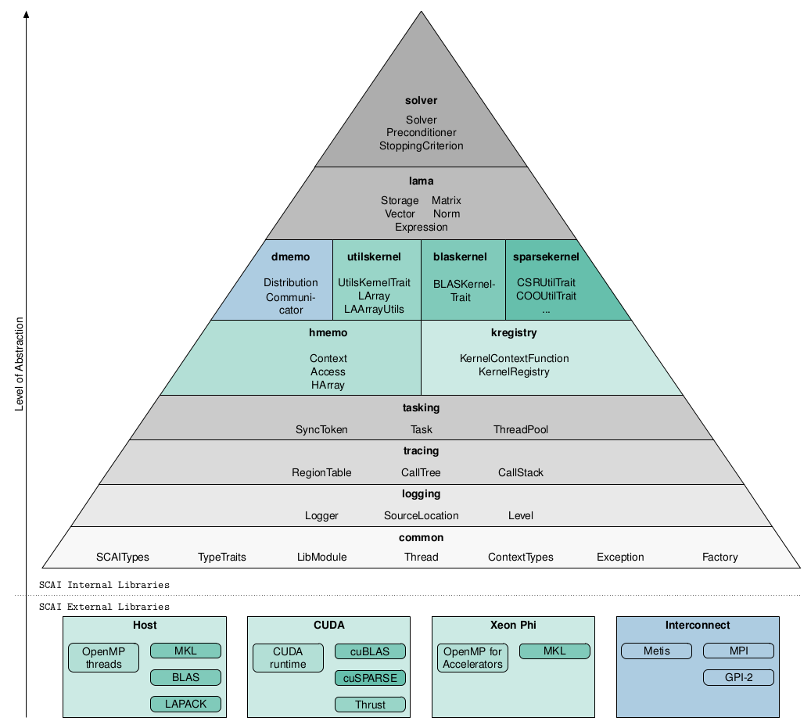

********
Projects
********

The LAMA library is build up of a couple of subproject, depending on each other.

You find special project specific details in the following:

.. toctree::
   :titlesonly:
   :maxdepth: 2

* :ref:`SCAI Common - Basic Concepts <scaicommon:main-page_common>`
* :ref:`SCAI Logging - Logging Macros <scailogging:main-page_logging>`
* :ref:`SCAI Tracing - Tracing Macros <scaitracing:main-page_tracing>`
* :ref:`SCAI Tasking - Asynchronous Tasks <scaitasking:main-page_tasking>`
* :ref:`SCAI Hmemo - Hybrid Memory Architecture <scaihmemo:main-page_hmemo>`
* :ref:`SCAI Kregistry - Generic Kernel Registry <scaikregistry:main-page_kregistry>`
* :ref:`SCAI BLASKernel - BLAS Kernel <scaiblaskernel:main-page_blaskernel>`
* :ref:`SCAI UtilsKernel - Utils Kernel <scaiutilskernel:main-page_utilskernel>`
* :ref:`SCAI SparseKernel - Sparse BLAS Kernel <scaisparsekernel:main-page_sparsekernel>`
* :ref:`SCAI Dmemo - Distributed Memory <scaidmemo:main-page_dmemo>`
* :ref:`SCAI LAMA - LAMA core <scailama:main-page_lama>`
* :ref:`SCAI Solver - Iterative Solver <scaisolver:main-page_solver>`

For detailed information you find our `System Documentation`_ generated by Doxygen.

.. _System Documentation : http://libama.sourceforge.net/doc/index.html