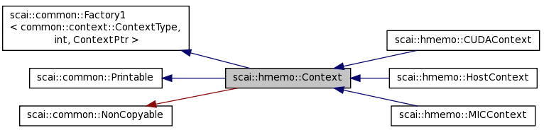

.. _Context:

Context
=======

 * Base class
 * One derived class for each ContextType
 * HostContext: stands for execution on Host CPU
 * Context is used to decide where operations are executed (be careful: data itself can be at different memory locations)
 * A derived class can have one object for each device
 * A device is initialized and freed with the corresponding constructor and destructor.

Here is the class hierarchy of the class Context:

In nearly all operations where a context appears as an argument a shared pointer for this context is used.
This guarantees that the device will be freed only if it is no more used for any heterogeneous array.

.. code-block:: c++

   typedef common::shared_ptr<Context> ContextPtr;

Be careful: a device is not freed by the C++ application as long as there is still a reference to the device.

 * Each single incarnation HData of a HArray has a context pointer as member variable.
 * Many other data structures in LAMA like matrices and vectors have a context that is used as the preferred context for operations on it.
 * Each Read- and each Write-Accesses on a heterogeneous arrays requires a context argument.
 * ``SCAI_CONTEXT_ACCESS( contextPtr )`` declares scope where functions should be executed on the given context
 * getContextMemoryPtr returns memory management class for the local memory on the corresponding context (device)
 * getHostMemoryPtr returns memory management class for pinned memory on the Host to enable faster or asynchronous data transfer
 * getMemoryPtr is used as working memory for the device:
 * zeroCopy disabled: ctx->getMemoryPtr() == ctx->getLocalMemoryPtr()
 * zeroCopy enabled: ctx->getMemoryPtr() == ctx->getHostMemoryPtr()

.. _hmemo-contextFactory:

Context Factory
---------------

As additional derived classes might be provided by dynamic library modules, a context factory is provided.

.. code-block:: c++

   typedef common::shared_ptr<Context> ContextPtr;
   class Context : public common::Factory1<common::ContextType, int, ContextPtr>
   { ...
   };

The create routine has two arguments:

  * the first argument type stands for the context type
  * the second argument of type int stands for the device id

The result of the create routine is a shared pointer for the corresponding context. A shared pointer (instead
of a usual pointer) is used as for each device there will be only one object and the caller does not take the
ownership of the device.

.. code-block:: c++

   ContextPtr loc = Context::getContextPtr( common::context::Host );
   ContextPtr loc = Context::getHostPtr();

   ContextPtr cudaCtx = Context::getContextPtr( common::context::CUDA);      // default device
   ContextPtr cudaCtx = Context::getContextPtr( common::context::CUDA, 0);

The default device is specified by the environment variable:

.. code-block:: c++

   export SCAI_DEVICE=1
   export SCAI_DEVICE=1:2
