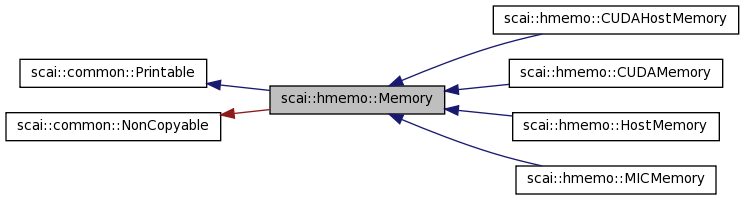
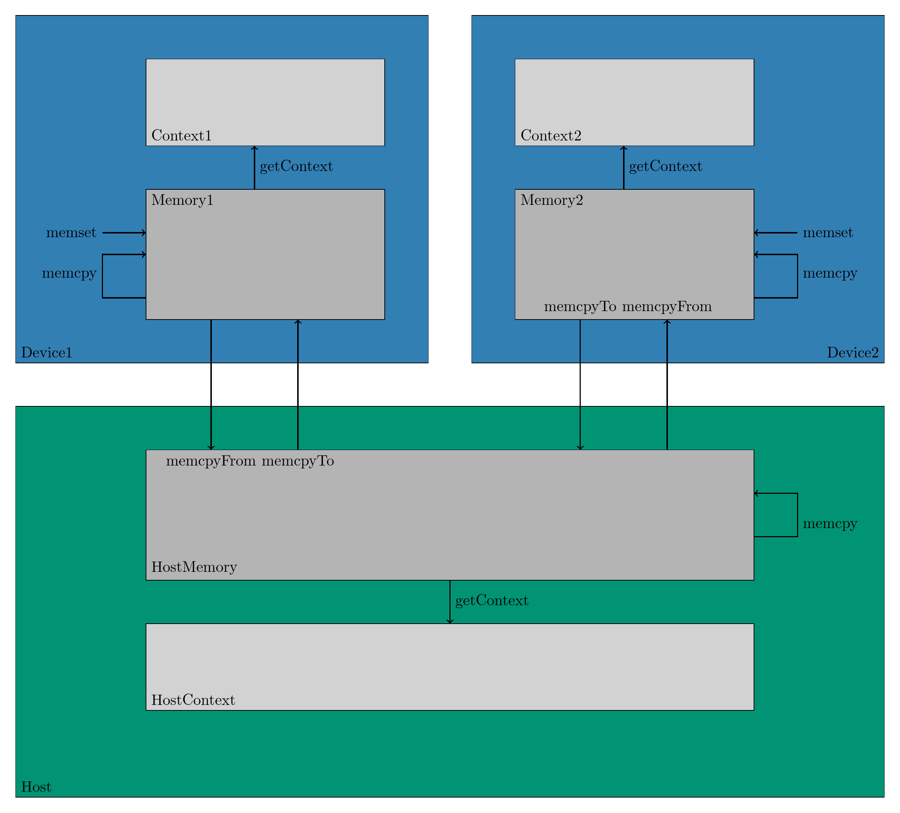

.. _Memory:

Memory
======

Memory itself is a polymorphic base class that defines some pure virtual functions that
must be provided by the derived classes.

These are the derived classes currently supported:

* HostMemory: Derived memory class for CPU memory management
* CUDAMemory: Derived memory class for CUDA memory management
* CUDAHostMemory: Derived memory class for pinned host memory

In the first LAMA release, context and memory were used synonymously as one context class.
Due to the pinned memory that might be used for faster memory transfer between Host and CUDA devices and
also for one-sided communication, a distinction became necessary.

In contrary to the context, there is no factory for the memory. Access to memory objects can only 
be achieved by querying the memory of a context.

.. code-block:: c++

    ContextPtr context = Context::getContextPtr( Context::CUDA );
    MemoryPtr contextmem = context->getContextMemoryPtr();
    MemoryPtr hostmem = context->getHostMemoryPtr();

* getContextMemoryPtr returns memory management class for the local memory on the corresponding context (device)
* getHostMemoryPtr returns memory management class for pinned memory on the Host to enable faster or asynchronous data transfer
* getMemoryPtr is used as working memory for the device

===============   =================   =================
Context           ContextMemory       HostMemory
===============   =================   =================
HostContext       HostMemory          HostMemory
CUDAContext       CUDAMemory          CUDAHostMemory
===============   =================   =================

The central operations for a memory object are the operations allocate, free, memcpy and memset.
They have exactly the same syntax and functionality as the routines of the C++ std library.
For the HostMemory class the operations are implemented via these operations.

.. code-block:: c++

    virtual void* allocate( const size_t size ) = 0;
    virtual void free( void* pointer, const size_t size ) = 0;
    virtual void memcpy( void* dst, const void* src, const size_t size ) const = 0;
    virtual void memset( void* dst, const int val, const size_t size ) const = 0;

Note: the free method uses the size argument to check for consistent use of free and allocate operations.

Furthermore each memory class contains two predicates that are used to query if memory
transfer to or from another memory location is supported or not.

.. code-block:: c++

  class Memory
  {
      ...

      virtual bool canCopyFrom( const Memory& srcMemory ) const;
 
      virtual bool canCopyTo( const Memory& dstMemory ) const;
    
  };

Remarks:

 * dstMemory.canCopyFrom( srcMemory ) and srcMemory.canCopyTo( dstMemory ) can have different values, 
   i.e. the corresponding memory transfer is only implemented by one memory class.
 * all memory classes should support copy from and to the Host memory

The supported memory transfer methods are also provided:

.. code-block:: c++

  class Memory
  {
      ...

      /** Copy from other memory to this memory. 
       *
       *  if canCopyFrom( srcMemory ) is false, this method throws an exception.
       */
      virtual void memcpyFrom( void* dst, const Memory& srcMemory, 
                               const void* src, size_t size ) const;
  
      /** Copy to other memory from this memory. 
       *
       *  if canCopyTo( dstMemory ) is false, this method throws an exception.
       */
      virtual void memcpyTo( const Memory& dstMemory, void* dst, 
                             const void* src, size_t size ) const;
  };

Copy routines should only be called if the corresponding transfer is supported,
otherwise an exception is thrown.

There are also aynchronous versions of the memory transfer provided that return a SyncToken object to wait for finalization.

The following figure shows how the different memory transfer operations interact with each other.

