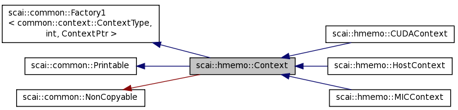
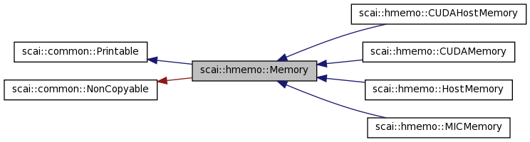

.. _main-page_hmemo:

SCAI HMemo
===========

Motivation
----------

HMemo stands for **Heterogeneous Memory** and is a library that provides a C++ container class
HArray (**Heterogeneous Array**) that manages multiple incarnations of the data on different devices.

Beside this container class some other classes are provided:

 * Context class to deal with different devices (Host for CPU, CUDA for GPU devices, MIC for Intel Xeon Phi, …)
 * Memory class to deal with different memory locations (device memory, CPU memory, pinned memory, …)
 * ReadAccess and Write Acess on a HArray in order to keep track at which locations valid memory data is available

Heterogeneous Array
-------------------

HArray is a template class where the template argument specifies the type of the elements of the array.

.. code-block:: c++

    HArray<double> A( N, 1.0 );

Compared to other container classes in C++ like the vector class, the following differences
should be observed:

 * Default constructor of ValueType is not exploited, explicit initialization is necessary.
 * Copy constructor of ValueType is not exploited, memory transfer is just done bytewise.

Usually the value type is a primitive type or other arithmetic types like complex<float> or complex<double>.

HMemo Classes
-------------

Here is a complete list of all provided classes of the HMemo library

=================     ================================================================================
Class                 Description
=================     ================================================================================
Context               Base class for different devices
HostContext           Derived context class for working on CPU (host)
CUDAContext           Derived context class for working on CUDA devices
Memory                Base class for memory management at a certain location
HostMemory            Derived memory class for CPU memory management
CUDAMemory            Derived memory class for CPU memory management
CUDAHostMemory        Derived memory class for pinned host memory
HData                 One incarnation of a HArray at one memory location
HDataManager          Deals with read and write requests and initiates corresponding memory transfers
_HArray               Common base class for HArray
HArray                Template container class
ReadAccess            Template class for read access on HArray
WriteAccess           Template class for write access on HArray
=================     ================================================================================

Context
-------

 * Base class
 * One derived class for each ContextType
 * HostContext: stands for execution on Host CPU
 * Context is used to decide where operations are executed (be careful: data itself can be at different memory locations)
 * A derived class can have one object for each device
 * A device is initialized and freed with the corresponding constructor and destructor.

Here is the class hierarchy of the class Context:

In nearly all operations where a context appears as an argument a shared pointer for this context is used.
This guarantees that the device will be freed only if it is no more used for any heterogeneous array.

.. code-block:: c++

   typedef common::shared_ptr<Context> ContextPtr;

Be careful: a device is not freed by the C++ application as long as there is still a reference to the device.

 * Each single incarnation HData of a HArray has a context pointer as member variable.
 * Many other data structures in LAMA like matrices and vectors have a context that is used as the preferred context for operations on it.
 * Each Read- and each Write-Accesses on a heterogeneous arrays requires a context argument.
 * ``SCAI_CONTEXT_ACCESS( contextPtr )`` declares scope where functions should be executed on the given context
 * getContextMemoryPtr returns memory management class for the local memory on the corresponding context (device)
 * getHostMemoryPtr returns memory management class for pinned memory on the Host to enable faster or asynchronous data transfer
 * getMemoryPtr is used as working memory for the device:
 * zeroCopy disabled: ctx->getMemoryPtr() == ctx->getLocalMemoryPtr()
 * zeroCopy enabled: ctx->getMemoryPtr() == ctx->getHostMemoryPtr()

Context Factory
---------------

As additional derived classes might be provided by dynamic library modules, a context factory is provided.

.. code-block:: c++

   typedef common::shared_ptr<Context> ContextPtr;
   class Context : public common::Factory1<common::ContextType, int, ContextPtr>
   { ...
   };

The create routine has two arguments:

  * the first argument type stands for the context type
  * the second argument of type int stands for the device id

The result of the create routine is a shared pointer for the corresponding context. A shared pointer (instead
of a usual pointer) is used as for each device there will be only one object and the caller does not take the
ownership of the device.

.. code-block:: c++

   ContextPtr loc = Context::getContextPtr( common::context::Host );
   ContextPtr loc = Context::getHostPtr();

   ContextPtr cudaCtx = Context::getContextPtr( common::context::CUDA);      // default device
   ContextPtr cudaCtx = Context::getContextPtr( common::context::CUDA, 0);

   ContextPtr micCtx = Context::getContextPtr( common::context::MIC, 0);

The default device is specified by the environment variable:

.. code-block:: c++

   export SCAI_DEVICE=1
   export SCAI_DEVICE=1:2

Memory
------

 * Base class
 * No factory, memory is provided by a context
 * Operations: allocate, free, memcpy 
 * Allocated data of a certain memory cannot be used everywhere
 * Generally it is not possible to identify by the address the memory on which it has been allocated

In the first LAMA release, context and memory were used synonymously as one context class.
Due to the pinned memory that might be used for faster memory transfer between Host and CUDA devices and
also for one-sided communication, a distinction became necessary.

 * getContextMemoryPtr returns memory management class for the local memory on the corresponding context (device)
 * getHostMemoryPtr returns memory management class for pinned memory on the Host to enable faster or asynchronous data transfer
 * getMemoryPtr is used as working memory for the device

===============   =================   =================
Context           ContextMemory       HostMemory
===============   =================   =================
HostContext       HostMemory          HostMemory
CUDAContext       CUDAMemory          CUDAHostMemory
MICContext        MICMemory           HostMemory
===============   =================   =================

A memory class must provide allocate and free operations.

.. code-block:: c++

  class Memory: 
  
      public  common::Printable,
      private common::NonCopyable

  {
  public:
  
      /** Return a context at which memory can be used, e.g. to be initialized.  */

      virtual ContextPtr getContextPtr() const = 0;

      /** Allocate of memory */

      virtual void* allocate( const size_t size ) = 0;

      /** Free the memory */

      virtual void free( void* pointer, const size_t size ) = 0;
 
      ...
  };

Note: the free method uses the size argument to check for consistent use of free and allocate operations.

Furthermore each memory class contains two predicates that are used to query if memory
transfer to or from another memory location is supported or not.

.. code-block:: c++

  class Memory
  {
      ...

      virtual bool canCopyFrom( const Memory& srcMemory ) const;
 
      virtual bool canCopyTo( const Memory& dstMemory ) const;
    
  };

Remarks:

 * dstMemory.canCopyFrom( srcMemory ) and srcMemory.canCopyTo( dstMemory ) can have different values, 
   i.e. the corresponding memory transfer is only implemented by one memory class.
 * all memory classes should support copy from and to the Host memory

The supported memory transfer methods are also provided:

.. code-block:: c++

  class Memory
  {
      ...

      /** Copy from other memory to this memory. 
       *
       *  if canCopyFrom( srcMemory ) is false, this method throws an exception.
       */
      virtual void memcpyFrom( void* dst, const Memory& srcMemory, 
                               const void* src, size_t size ) const;
  
      /** Copy to other memory from this memory. 
       *
       *  if canCopyTo( dstMemory ) is false, this method throws an exception.
       */
      virtual void memcpyTo( const Memory& dstMemory, void* dst, 
                             const void* src, size_t size ) const;
  };

Copy routines should only be called if the corresponding transfer is supported,
otherwise an exception is thrown.

There are also aynchronous versions of the memory transfer provided that return a SyncToken object to wait for finalization.

HArray
------

HArray is container where data might be allocated at different memory locations. 

One incarnation is an object of the class HData and contains the following member variables:

=========    ==============================================
Property     Value
=========    ==============================================
mMemory      memory location 
mPtr         pointer to the allocated data
mCapacity    number of allocated bytes
mValid       true if this incarnation contains valid values
=========    ==============================================

Member variables of HArray:

==========   ==============================================
Property     Value
==========   ==============================================
mSize        size of the array
mValueSize   number of bytes for one element
constFlag    true for read-only
mData        list of current incarnations
mAccess      Read/Write access 
==========   ==============================================

Snapshot of a HArray( size = 1024, valueSize = 8 )

=======  ==========   ========
memory   capacity     valid
=======  ==========   ========
Host     8192         true
CUDA-0   8192         false
CUDA-1   8192         false
=======  ==========   ========

After initialization, at least one data entry is always valid.
The capacity specifies the allocated size on the memory, must be sufficient in case of valid data.

Here are some examples of initialization:

.. code-block:: c++

  HArray<double> A( 1024 );

A( size = 1024, valueSize = 8 ):

=======  ==========   ========
memory   capacity     valid
=======  ==========   ========
x        x            x
=======  ==========   ========

.. code-block:: c++

  HArray<double> A( host );

A( size = 0, valueSize = 8 ):

=======  ==========   ========
memory   capacity     valid
=======  ==========   ========
Host     0            false
=======  ==========   ========

.. code-block:: c++

  HArray<double> A( 1024, host );

A( size = 1024, valueSize = 8 ):

=======  ==========   ========
memory   capacity     valid
=======  ==========   ========
Host     8192         false
=======  ==========   ========

.. code-block:: c++

  HArray<double> A( 1024, host, 1.0 );

A( size = 1024, valueSize = 8 ):

=======  ==========   ========
memory   capacity     valid
=======  ==========   ========
Host     8192         true
=======  ==========   ========

Read-/WriteAccess
-----------------

Each use of the heterogeneous array requires an access

 * Accesses take care of valid data at the given context
 * i.e. take care of the corresponding memory transfer
 * Check for consistent use ( no read/write accesses at different locations)
 * Get operation provides pointer to the data
 * Be careful: never use data pointers outside the scope of accesses
 * Most checks are only possible at runtime

Example of ReadAccess:

.. code-block:: c++

  HArray<double> A( 1024, host, 1.0 );

A( size = 1024, valueSize = 8 ):

=======  ==========   ========
memory   capacity     valid
=======  ==========   ========
Host     8192         true
=======  ==========   ========

.. code-block:: c++

  ReadAccess<double> readA( A, cuda )

By the read access, memory is allocated at CUDA device memory
and valid data is copied from Host to CUDA.

A( size = 1024, valueSize = 8 ):

=======  ==========   ========
memory   capacity     valid
=======  ==========   ========
Host     8192         true
CUDA     8192         true
=======  ==========   ========

Example of WriteAccess:

.. code-block:: c++

  HArray<double> A( 1024, host, 1.0 );

A( size = 1024, valueSize = 8 ):

=======  ==========   ========
memory   capacity     valid
=======  ==========   ========
Host     8192         true
=======  ==========   ========

.. code-block:: c++

  WriteAccess<double> writeA( A, cuda )

By the write access, memory is allocated at CUDA device memory
and valid data is copied from Host to CUDA. As data will be written
on the CUDA device, the Host incarnation becomes invalid.

A( size = 1024, valueSize = 8 ):

=======  ==========   ========
memory   capacity     valid
=======  ==========   ========
Host     8192         false
CUDA     8192         true
=======  ==========   ========

Example of WriteOnlyAccess:

.. code-block:: c++

  HArray<double> A( 1024, host, 1.0 );

A( size = 1024, valueSize = 8 ):

=======  ==========   ========
memory   capacity     valid
=======  ==========   ========
Host     8192         true
=======  ==========   ========

.. code-block:: c++

  WriteOnlyAccess<double> writeA( A, cuda )

By the write access, memory is allocated at CUDA device memory
but **no data** is copied from Host to CUDA. As data will be written
on the CUDA device, the Host incarnation becomes invalid.

A( size = 1024, valueSize = 8 ):

=======  ==========   ========
memory   capacity     valid
=======  ==========   ========
Host     8192         false
CUDA     8192         true
=======  ==========   ========

Example of resize:

A( size = 1024, valueSize = 8 )

=======  ==========   ========
memory   capacity     valid
=======  ==========   ========
Host     8192         true
CUDA-1   8192         false
CUDA-2   16384        true
=======  ==========   ========

.. code-block:: c++

  A.resize( 2048 );

The resize operation only reallocates data for all valid incarnations that
have not sufficient capacity. So for the above example only the Host
incarnation is reallocated.

A( size = 2048, valueSize = 8 )

=======  ==========   ========
memory   capacity     valid
=======  ==========   ========
Host     16384        true
CUDA-1   8192         false
CUDA-2   16384        true
=======  ==========   ========

Clear, Purge:

clear is the same as resize( 0 ) operation. It does not free any memory.
If the size is 0, the valid flag of an incarnation does not matter.

.. code-block:: c++

  A.clear();

A( size = 0, valueSize = 8 )

=======  ==========   ========
memory   capacity     valid
=======  ==========   ========
Host     16384        true
CUDA-1   8192         false
CUDA-2   16384        true
=======  ==========   ========

Access Conflicts
----------------

The following situations result in an access conflict:

 * Two accesses on a different context if at least one is a write access;
   there is no guarantee for valid data
 * Two accesses by different threads if at least one is a write access
   There is not guarantee for valid data

Read and write access by same thread on same context is possible
Due to alias (e.g. X = 5 * X + 3 * Y ) this happens. But with a write and 
read access at the same time, the resize operation will throw an exception
if a reallocation becomes necessary.

Example 1:

.. code-block:: c++

  HArray<double> A( 1024, host, 1.0 );
  WriteAccess<double> writeA( A, cuda );

A( size = 1024, valueSize = 8 ):

=======  ==========   ========
memory   capacity     valid
=======  ==========   ========
Host     8192         false
CUDA     8192         true
=======  ==========   ========

.. code-block:: c++

  ReadAccess<double> readA( A, host);  // fails, conflict to write on CUDA
  WriteAccess<double> writeA1( A, host);  // fails, conflict to write on CUDA
  ReadAccess<double> readA( A, cuda);  // fails, as might have been resized 

Example 2:

.. code-block:: c++

  HArray<double> A( 1024, host, 1.0 );
  ReadAccess<double> readA( A, cuda );

A( size = 1024, valueSize = 8 ):

=======  ==========   ========
memory   capacity     valid
=======  ==========   ========
Host     8192         true
CUDA     8192         true
=======  ==========   ========

.. code-block:: c++

  ReadAccess<double> readA1( A, host);  // okay
  WriteAccess<double> writeA( A, host);  // fails
  WriteAccess<double> writeA( A, cuda);  // okay for same thread
  writeA.resize( 2048 );                 // fails

Alias Problem
-------------

Many mathematical routines might ujse lhs array also on rhs.

.. code-block:: c++

  template<typename T>
  void add ( HArray<T>& res, const HArray<T>& a, const Harray<T>& b )
  {
      SCAI_ASSERT_LE( a.size(), b.size(), "size mismatch" )
  
      IndexType n = a.size();

      ContextPtr hostCtx = Context::getHostPtr();

      WriteOnlyAccess<T> write( res, hostCtx, n );
      ReadAccess<T>readA( a, hostCtx );
      ReadAccess<T>readB( b, hostCtx );
   
      double* resPtr = write.get();
      const double* aPtr = readA.get();
      const double* bPtr = readB.get();
  
      add[context]( resPtr, aPtr, bPtr, n );
  }
 
.. code-block:: c++

  add( a, b, c ); // this is okay
  add( a, a, b ); // here we have an ALIAS

Solution 1:

Check for alias and use appropriate accesses:

.. code-block:: c++

  if ( &res == &a )
  {
      hmemo::WriteAccess<T> write( res, hostCtx, n );
      hmemo::ReadAccess<T>readB( b, hostCtx );
      add[context]( write.get(), write.get(), readB.get(), n );
  }
  else if ( &res == &b )
  {
      hmemo::WriteAccess<T> write( res, hostCtx, n );
      hmemo::ReadAccess<T>readA( a, hostCtx );
      add[context]( write.get(), readA.get(), write.get(), n );
  }
  else
  {
      hmemo::WriteOnlyAccess<T> write( res, hostCtx, n );
      hmemo::ReadAccess<T>readA( a, hostCtx );
      hmemo::ReadAccess<T>readB( b, hostCtx );
      add[context]( write.get(), readA.get(), readB.get(), n );
  }
 

Solution 2:

Allow write and read access at same context.

.. code-block:: c++

  hmemo::WriteOnlyAccess<T> write( res, ctx, n );
  hmemo::ReadAccess<T>readA( a, ctx);
  hmemo::ReadAccess<T>readB( b, ctx);

If res == a, then ReadAccess after WriteAccess is not allowed as data might be resized.

.. code-block:: c++

  hmemo::ReadAccess<T>readA( a, ctx);
  hmemo::ReadAccess<T>readB( b, ctx);
  hmemo::WriteOnlyAccess<T> write( res, ctx, n );

This is fine, resize on res is not needed.

Prefetch
--------

Each HArray has a prefetch method in order to get a valid incarnation of the array
at a certain context. If a memory transfer is required, this memory transfer is started
asynchronously. Synchronization is done implicitly with the next access to the array.

.. code-block:: c++

  ContextPtr cudaContext = Context::getContextPtr( common::context::CUDA );
  ContextPtr hostContext = Context::getContextPtr( common::context::Host );
  HArray<double> A;
  ...
  {
      WriteAccess<double> wA( A, hostContext );
      ...
  } // valid data only on Host

  A.prefetch( cudaContext ); // starts async transfer Host->GPU

  workload( dummy, NWORK );  // overlaps with memory transfer

  {
      WriteAccess<double> rA( A, cudaContext ); // waits until transfer is complete
      ...
  }

An asynchronous memory transfer to a CUDA device is done via a CUDA stream if the 
incarnation of the array on the Host is in the CUDA Host memory. Otherwise a
separate thread is started that takes care of the memory transfer.

Using Pinned Memory
-------------------

By default, an incarnation of an Harray on the host is allocated in the Host memory.

.. code-block:: c++

  ContextPtr hostContext = Context::getContextPtr( common::context::Host );
  HArray<double> A;
  {
      // will use HostMemory
      WriteOnlyAccess<double> wA( A, hostContext, N );
      ...
  }

If the data is later needed on the GPU, no fast memory transfer is possible as 
the data is not in the pinned memory. The allocation of host memory in the pinned 
memory can be forced as follows:

.. code-block:: c++

  ContextPtr hostContext = Context::getContextPtr( common::context::Host );
  ContextPtr cudaContext = Context::getContextPtr( common::context::CUDA );

  HArray<double> A( cudaContext );
  {
      // will use CUDAHostMemory
      WriteOnlyAccess<double> wA( A, hostContext, N );
      ...
  }
  {
      ReadAccess<double> ra( A, cudaContext );   // fast memory transfer
      ...
  }

The use of a context pointer in the constructor works like a first touch on the 
corresponding context.

.. code-block:: c++

  HArray<double> A( cudaContext );

  HArray<double> A;
  {
      WriteAccess<double> dummyW( A, cudaContext );
  }

Some other strategies have been dropped for these reasons:

 * Using pinned memory as default memory on the Host is not recommended as 
   allocation in pinned memory is 10 up to 100 times slower.

 * Pinning already allocated unpinned memory might be possible e.g. when data transfer
   to the GPU is required. This does not fit well in the design concept that handles
   the two memory classes separately. Furthermore, using this as a general strategy
   is not always recommended as the overhead does not pay off with one single transfer.

HArrayRef
---------

Each incarnation of an HArray is allocated in a corresponding memory object where the
memory management is handled by a corresponding manager.
Therefore data from any input array must be copied explicitly in the container.

.. code-block:: c++

  double* data = new double[N];
  read_data( data, N );
  ...
  HArray<double> vector;
  {
      WriteOnlyAccess<double> write( vector, host, N );
      for ( IndexType i = 0; i < N; ++i ) write[i] = data[i];
  }

  ReadAccess<double> write( vector, gpu); // now work on it on GPU

The class HArrayRef is provided to deal with such a situaton.

.. code-block:: c++

  double* data = new double[N];
  read_data( data, N );
  HArrayRef<double> vector( data, N )
  WriteAccess<double> write( vector, gpu); // now work on it on GPU

The memory at the pointer data will be used as incarnation on the Host memory 
As the data is not copied, it is not possible to resize the HArray ``vector``. 
The destructor of the array takes care that the specified memory will contain
a valid copy of the data.

Non-Zero Copy
-------------

 * CUDA devices can also operate on CUDA Host memory
 * Avoids data transfer to and from the device
 * But: operations are much faster if CUDA device memory is used

.. code-block:: c++

  {
      // Init on host
      WriteOnlyAccess<double> write( array, hostContext, N );
      double* v = write.get();
      for ( IndexType i = 0; i < N; ++i )
      {
          v[i] = 0.0;
      }
  }
  {    // work on GPU
       WriteAccess<double> write( array, cudaContext );
       work1[cudaContext]( write.get(), N );
  }

  {    // work on Host
       WriteAccess<double> write( array, hostContext );
       work2[hostContext]( write.get(), N );
  }

If array is allocated in CUDAHostMemory, no data transfer is needed.

The Local Array LArray
----------------------

The array class **LArray** stands for a local array and is derived from the class *HArray*. Regarding
the member variables it is exactly the same, but it offers many addtional operators.

.. code-block:: c++

    template<typename T>
    class LArray : HArray<T>
    { 
    }

For the implementation of the operators kernel functions implemented on different devices
are used.

.. code-block:: c++

  LArray<double> A;
  input( A );
  LArray<float> B( A );   // implicit conversion
  ...
  double x = A[0];
  A[1] = x * 2.0;
  A[2] = A[1];

  LArray<IndexType> IND;
  A[IND] = C;  !
  C = B[IND];

  A = 2.0 * B;
  A = A * B;   // componentwise multiplication
