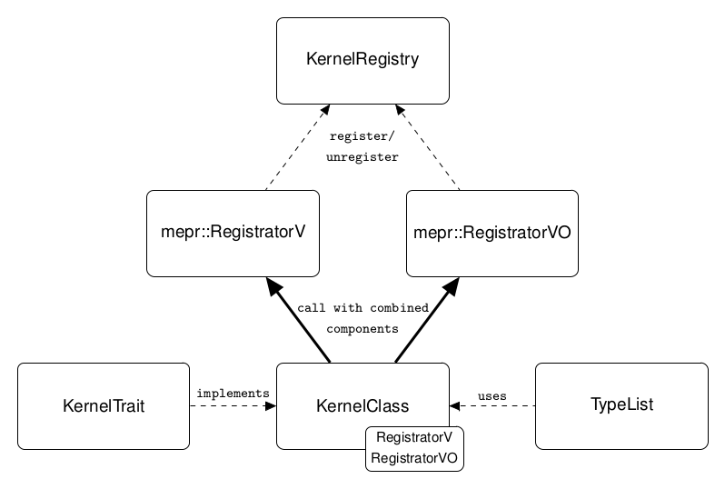

Registrator
===========

The ``Registrator`` is used for the registration of functions with a given list of value types. 
These functions have to be grouped in a special class, in the following called KernelClass. 
This class needs to implemented local classes. These can be created by using the ``SCAI_KREGISTRY_DECL_REGISTRATOR``
macro. If the KernelClass consists of different kind of functions like non-templated, single templated or
double templated, for every type a Registrator is needed. 

- If you have functions which are not templated, you have to call 

  - ``SCAI_KREGISTRY_DECL_REGISTRATOR( Registrator )``.

- If you have functions which are simple templated, you have to call 

  - ``SCAI_KREGISTRY_DECL_REGISTRATOR( RegistratorV, template<typename ValueType> )``.

- If you have functions which are double templated, you have to call 

  - ``SCAI_KREGISTRY_DECL_REGISTRATOR( RegistratorVO, template<typename ValueType, typename OtherValueType> )``.

The KernelClass should be implemented as singleton, but the instance shouldn't be accessible. Due to the singleton
the call of the Registrator can be done within the constructor (register) and destructor (unregister).
In the constructor and destructor the function ``Registrator::initAndReg``, ``mepr::RegistratorV`` and/or the 
``mepr::RegistratorVO`` will be called, with the given TypeList. The following listing shows how the registration
can be done using the constructor of a KernelClass. 

.. code-block:: c++

	OpenMPUtils::OpenMPUtils()
	{
	    const kregistry::KernelRegistry::KernelRegistryFlag flag = kregistry::KernelRegistry::KERNEL_ADD;
	
	    Registrator::initAndReg( flag );
	    kregistry::mepr::RegistratorV<RegistratorV, SCAI_ARITHMETIC_ARRAY_HOST_LIST>::call( flag );
	    kregistry::mepr::RegistratorVO<RegistratorVO, SCAI_ARITHMETIC_ARRAY_HOST_LIST, SCAI_ARITHMETIC_ARRAY_HOST_LIST>::call( flag );
	
	}

