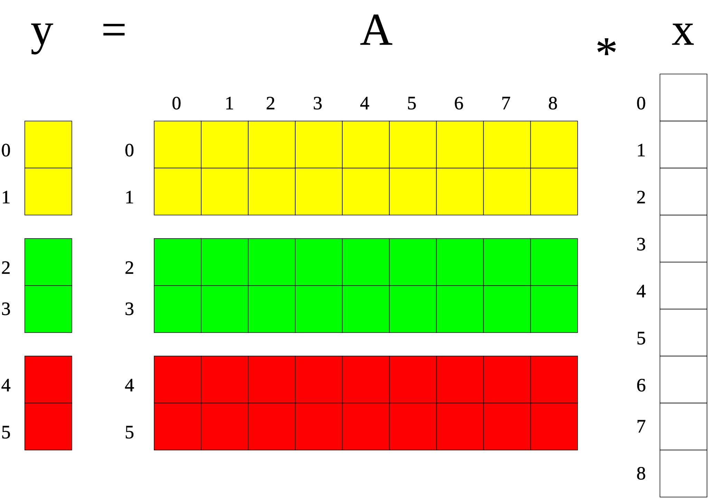

.. _lama_Matrix:

Matrix
======

The class ``Matrix`` is a generic mathematical matrix. The index and data arrays are internally stored in a ``HArray`` out of :ref:`scaihmemo:main-page_hmemo` so a ``Matrix`` can transparently used on every device. Additionally a ``Matrix`` can be distributed among nodes by having a specific ``Distribution`` from :ref:`scaidmemo:main-page_dmemo` - by default it has a NoDistribution, which means its values are replicated on each node. Having another ``Distribution`` results in a row-wise distributed matrix, so a whole row is located on a assigned node. A ``Matrix`` also has a second column-oriented ``Distribution``, for handling halo-exchange in distributed expressions. A detailed explanation on setting ``Distributions`` can be found :doc:`here <SetDistribution>`.

A specific representation of a matrix can be a DenseMatrix or a sparse matrix of a specific storage type. A DenseMatrix saves all entries of the m times n matrix, while a sparse matrix only stores the non-zero entries in a well defined format. LAMA actually preserves the following sparse matrix formats (for detailed descriptions on the formats refer to the subpages of :ref:`scaisparsekernel:main-page_sparsekernel`:

 - :ref:`COO <scaisparsekernel:sparsekernel_COO>` (Coordinate)
 - :ref:`CSR <scaisparsekernel:sparsekernel_CSR>` (Compressed Sparse Row)
 - :ref:`DIA <scaisparsekernel:sparsekernel_DIA>` (Diagonal)
 - :ref:`ELL <scaisparsekernel:sparsekernel_ELL>` (ELLPACK-R)
 - :ref:`JDS <scaisparsekernel:sparsekernel_JDS>` (Jagged Diagonal Storage)

Distribution of Matrices
------------------------

Each matrix has two distributions.

 - the target or row distribution specifies the distribution of the target vector.
 - the source or column distribution specifies the distribution of the source vector,

In contrary to the column distribution, the row distribution is internally used to map the matrix data to the different
processors.

  
    Row distribution of a matrix.

For a matrix-vector multiplication each processor computes only its part of the target vector 
and so it needs only the values of the corresponding rows of the matrix. 
Communication is only required for the source vector as each processor might need values from
the other processors.

The column distribution is used internally on each processor to split up the matrix data into 
local and non-local parts (sparse matrix) or to chunks to deal with each part of the source vector individiually (dense matrix).

  
    Column distribution of a matrix.

The column distribution determines the communication pattern that becomes necessary
for a matrix-vector multiplication. The splitting of the columns allows overlapping of computation and communication.

Constructors
------------

The class ``Matrix`` is an abstract class that can be used for generic algorithm formulation.
For instantiating a matrix variable you need to call the constructor one of the following templated matrix classes, that are a specific representation of a matrix holding the matrix entries:

 * COOSparseMatrix
 * CSRSparseMatrix
 * DIASparseMatrix
 * DenseMatrix
 * ELLSparseMatrix
 * JDSSparseMatrix

For creating a new Matrix you need these major things:
 * the number of rows of the matrix
 * the number of columns of the matrix
 * the data of the matrix either in csr representation (:ref:`details<scaisparsekernel:sparsekernel_CSR>`)
    * number of nonzeros
    * ia array
    * ja array
    * values array

For distributed matrices the number of rows/columns can be substituted by a ``Distribution`` (holding the number of rows/columns as row/column distribution strategy). For defining a Distribution, please refer to :ref:`this <scaidmemo:main-page_dmemo>` page.

The data structures for the csr representation can be passed by raw data pointers.
Alternatively you can read the matrix data (size and data) from file, by specifing the filename. For a detailed description of the supported file formats, please refer to :ref:`lama_IO`. All data read in is stored in CSRStorage and converted to the target format afterwards.

Optionally you can specify a (initial) ``Context`` for the Vector, to define on which context the (initial) data is valid. For detailed explanation of the Context class, please refer to :ref:`this <scaihmemo:main-page_hmemo>` page.

Conversion between the different matrix formats is preserved internally, so you can create each matrix type out of
another using the copy constructor.

.. code-block:: c++

  // for later use:
  int numRows    = 6;
  int numColumns = 4;
  dmemo::CommunicatorPtr comm( dmemo::Communicator::getCommunicatorPtr( Communicator::MPI ) );
  dmemo::DistributionPtr rDist( dmemo::Distribution::getDistributionPtr( "BLOCK", comm, numRows, 1.0 ) );
  dmemo::DistributionPtr cDist( dmemo::Distribution::getDistributionPtr( "BLOCK", comm, numColumns, 1.0 ) );
  common::ContextPtr cudaContextPtr = common::Context::getContextPtr( common::context::CUDA );

  // empty (not initialized) float matrices (with size or distribution)
  COOSparseMatrix<float> a();                      // without size
  CSRSparseMatrix<float> b( numRows, numColumns ); // local matrix with size 6x4
  DenseMarix<float> c( rDist, cDist );             // block distributed matrix with global size 6x4
  DIASparseMatrix<float> square2( numRows );       // local matrix with size 6x6
  ELLSparseMatrix<float> square1( rDist );         // block distributed matrix with global size 6x6

  // initialize with csr representation
  int nnz = 13
  IndexType ia[] = {0, 2, 4, 6, 9, 11, 11, 13};
  IndexType ja[] = {0, 3, 1, 0, 2, 3, 3, 0, 1, 0, 3, 1, ,3};
  double values[] = {6.0, 4.0, 0.0, 7.0, 9.0, 4.0, 3.0, 2.0, 5.0, 2.0, 1.0, 1.0, 2.0};
  JDSSparseMatrix<double> initilized( numRows, numColumns, nnz, &ia, &ja, &values );

  // reading from file (only on local matrices, can be redistributed afterwards)
  COOSparseMatrix<ValueType> jdsMatrix( "matrix.mtx" );

  // copy constructor (also works with general Matrix 'a')
  CSRSparseMatrix<double> aCopy   ( a );
  DenseMatrix<double> aRedist ( a, rDist, cDist ); // a with new Distributions
  ELLSparseMatrix<double> aTrans  ( a, true );     // copy with transpose

Initializing
------------

After the declaration of an empty matrix you can initialize it with value with the functions ``setIdentity``, ``setDiagonal``, ``setDenseData`` and ``setCSRData``.

.. code-block:: c++

  a.setIdentity( numRows ); // initializing a 6x6 identity matrix
  // is the same as:
  a.setDiagonal( 1.0f ); // initilizing with a scalar value or a Scalar variable
  // or:
  DenseVector<float> oneVector( numRows, 1.0f );
  a.setDiagonal( oneVector );

  b.setRawCSRData( rDist, cDist, nnz, &ia, &ja, &values );

  float denseValues[] = {1.0f, 1.1f, 1.2f, 1.3f,
                         2.0f, 2.1f, 2.2f, 2.3f,
                         3.0f, 3.1f, 3.2f, 3.3f,
                         4.0f, 4.1f, 4.2f, 4.3f,
                         5.0f, 5.1f, 5.2f, 5.3f,
                         6.0f, 6.1f, 6.2f, 6.3f};
  b.setRawDenseData( rDist, cDist, values ); // optional fourth parameter eps: minimal value that is stored in sparse matrices

Alternatively, you can create a ``Matrix`` from a matrix storage. As example we fill a CSRStorage with CSR data to create a CSRSparseMatrix:

.. code-block:: c++

    typedef ValueType double;
    int numValues = 12;
    IndexType ia[] = { 0, 2, 3, 5, 8, 10, 10, 12 };
    IndexType ja[] = { 0, 3, 0, 2, 3, 0, 1, 3, 0, 3, 1, 3 };
    ValueType values[] = { 6.0f, 4.0f, 7.0f, -9.3f, 4.0f, 2.0f, 5.0f, 3.0f, 2.0f, 1.0f, 1.0f, 2.0f };
    
    const LArray<IndexType> mIA     = LArray<IndexType>( m + 1, ia );
    const LArray<IndexType> mJA     = LArray<IndexType>( numValues, ja );
    const LArray<ValueType> mValues = LArray<ValueType>( numValues, values );
    
    CSRStorage<ValueType>* csrStorage = new CSRStorage<ValueType>( m, n, numValues, mIA, mJA, mValues );
    
    CSRSparseMatrix<ValueType> csrMatrix( *csrStorage );

Expressions
-----------

Now, also having matrices, you can perform matrix expressions as addition, substraction, multiplication with other matrices or vectors and scaling with a scalar in text-book syntax. We have implemented the expressions to a maximal length of the form:

.. code-block:: c++

    // matrix-vector-expressions
    v_z = s_alpha * m_A * v_x + s_beta * v_y;

    // vector-matrix-expressions
    v_z = s_alpha * v_x * m_A + s_beta * v_y;
    // resulting in better performance in most cases: 
    Matrix m_Atrans ( m_A, true );
    v_z = s_alpha * m_Atrans * v_x + s_beta * v_y;

    // matrix-matrix-expressions
    m_D = s_alpha * m_A * m_B + s_beta * m_C;

All specialization of these two forms (e.g. s_alpha = 1, s_beta = 0) are valid expressions:

.. code-block:: c++

   Scalar s( 2.0 );
   DenseVector x( m, 1.0 );
   DenseVector y( m, 3.0 );
   
   DenseVector r = csrMatrix * x;
   r = csrMatrix * x + y;
   r = csrMatrix * x + 2.0 * y;
   r = csrMatrix * x + y * 2.0;
   
   a = s * csrMatrix;
   b = a + csrMatrix;

Also the combination with the assign operator is possible (internally handled as v_z = s_alpha * m_A * v_x + s_beta * v_z or mD = s_alpha * m_A * m_B + s_beta * m_D):

.. code-block:: c++

   r += 1.5 * csrMatrix * x;
   c += 3.3 * csrMatrix

Access of Rows, Columns, and Diagonal
-------------------------------------

The following functions can be used to get a copy of a column or row of a matrix.

.. code-block:: c++

   const Matrix& mat = 
   Vector& row = ...;
   Vector& col = ...;
   ...
   mat.getRow( row, rowIndex );
   mat.getColumn( col, columnIndex );

When getting a row, the result vector is replicated on all processors. When getting a
column, the result vector has the same distribution as the row distribution of the matrix.

By corresponding setter operations, a row, a column or the diagonal of a matrix can be set 
or updated. Different binary operations are supported to combine the old column values
with the new ones, the replacement is forced by the COPY operation.

.. code-block:: c++

   Matrix& a = 
   const Vector& row = ...;
   const Vector& col = ...;
   ...
   a.setRow( row, rowIndex, binary::COPY );
   a.setColumn( col, columnIndex, binary::ADD );

In a similiar way, get and set of the diagonal is supported. Here, the set operation supports only 
the replacement of the old diagonal values. The distribution of the diagonal will be the same
as the row distribution of the matrix (for getDiagonal) or must be the same when it is set.
Access of the diagonal of a matrix is only possible if the matrix has the diagonal flag. This
is true for dense matrices, but also for sparse matrices that are square and have been filled
with entries for each diagonal element.

.. code-block:: c++

   Matrix& mat = ...
   Vector& diagonal = ...
   ...
   mat.getDiagonal( diag );
   // Note: diag.getDistribution() == mat.getRowDistribution() is now valid
   ...
   // diag.getDistribution() == mat.getRowDistribution() must be valid
   mat.setDiagonal( diag );

Access of Matrix Elements
-------------------------

Even if it is not recommended or not efficient at all, the entries of a matrix can be 
elementwise accessed.

.. code-block:: c++

   Matrix& mat = 
   Scalar S;
   ...
   S = mat.getValue( i, j );
   mat.setValue( i, j, binary::MIN )

The following items should be kept in mind when using these routines:

 * Getting a single element of a distributed matrix implies always a broadcast of the element
 * Setting a single element in a sparse matrix is only possible when the matrix has had an
   entry at the corresponding position before. Otherwise an exception is thrown.
   For filling a sparse matrix elementwise the MatrixAssembly class should be used.

Instead of using the ``getValue`` method it is possible to use to operator ``()`` 
where both need the global row index ``i`` and column index ``j``. 

.. code-block:: c++

   Matrix& mat = 
   Scalar S;
   ...
   S = mat.getValue( i, j );
   S = mat( i, j );

Utility Functions
-----------------

Additionally you have some utility functions that can be called on a matrix: for getting sizes or distributions of the matrix, e.g. after reading it from file, for swapping with another matrix or creating a copy.

.. code-block:: c++

   IndexType m = csrMatrix.getNumRows();           // returns global number of rows alternative use getLocalNumRows
   IndexType n = csrMatrix.getNumColumns();        // returns global number of columns alternative use getLocalNumColumns
   IndexType numValues = csrMatrix.getNumValues(); // returns global number of values alternative use getLocalNumValues
   DistributionPtr rowDist = csrMatrix.getDistributionPtr();
   DistributionPtr colDist = csrMatrix.getColDistristributionPtr();

   csrMatrix.swap( a ); // swapping the size and values of the matrices

   Vector* aCopy = a.copy(); // calls the copy constructor

File I/O
--------

Except from a constructor with a passed string, you can use ``readFromFile`` and ``writeToFile``. The generally excepted format in LAMA for vector and matrices is defined :doc:`here<FileIO>`.

.. code-block:: c++
 
   csrMatrix.readFromFile( "matrix.mtx" );
   // writing a vector to file in matrix market format in single precision
   csrMatrix.writeToFile( "output.mtx" );

Matrix Assembly
---------------

The template class MatrixAssembly allows to assemble matrix entries by different processors
independently. It is the counterpart to the VectorAssembly class and has exactly the
same functionality.

.. code-block:: c++

    MatrixAssemblyAccess<ValueType> assembly( matrix, common::binary::ADD );

    // each processor might push arbitrary matrix elements

    assembly.push( i1, j1, val1 );
    ...
    assembly.push( i2, j2, val2 );

    CSRSparseMatrix<ValueType> matrix( rowDist, colDist );
    matrix.fillAssembly( assembly, common::BinaryOp::COPY );

- The distribution of a matrix must be set before filling the matrix with the assembled data.
- Filling the matrix with assembled data is a global method, i.e. all processors must call this method together.
- Zero elements might be filled explicitly to reserve memory in the sparse matrix.
- Different modes are supported if entries are assembled twice, either by same or by different processors or for existing entries.
  In the REPLACE mode (default, common::binary::COPY) values will be replaced; different assembled values for the same entry
  might be undefined. In the SUM mode (common::binary::ADD) assembled values for the same coordinates are added.
  the Halo schedule might be built multiple times.

Math Functions
--------------

You can scale a ``Matrix`` with a Scalar or a Vector (each row with another value):

.. code-block:: c++

   csrMatrix.scale( 2.0 );
   csrMatrix.scale( *diag );

You can get the L1-, L2-, Maximum-norm of an ``Matrix`` and a norm of the maximum difference to another ``Matrix``:

.. code-block:: c++

   s = csrMatrix.l1Norm();
   s = csrMatrix.l2Norm();
   s = csrMatrix.maxNorm();
   s = csrMatrix.maxDiffNorm();

Output operator
---------------
 
Also the output operator for a ``Matrix`` is implemented, giving you informations about its sizes and ``Distributions``  and ``Contexts``.

.. code-block:: c++ 
  
    std::cout << "my matrix A looks like: " << matrixA << std::endl;

The output will look like the following, telling you matrixA is a CSRSparseMatrix of type float (consisting of local and halo storage of type CSRStorage<float>) with global size 7 times 4. It stores 12 nonzeros in the local storage and an empty halo storage (having NoDistributions for rows and columns with the respecting sizes).
       
.. code-block:: bash

    my matrix A looks like: CSRSparseMatrix<float>( size = 7 x 4, local = CSRStorage<float>( size = 7 x 4, nnz = 12, diag = 0, sorted = 0 ), halo = CSRStorage<float>( size = 7 x 0, nnz = 0, diag = 1, sorted = 0 ), rowdist = NoDistribution( size = 7 ), coldist = NoDistribution( size = 4 ))
