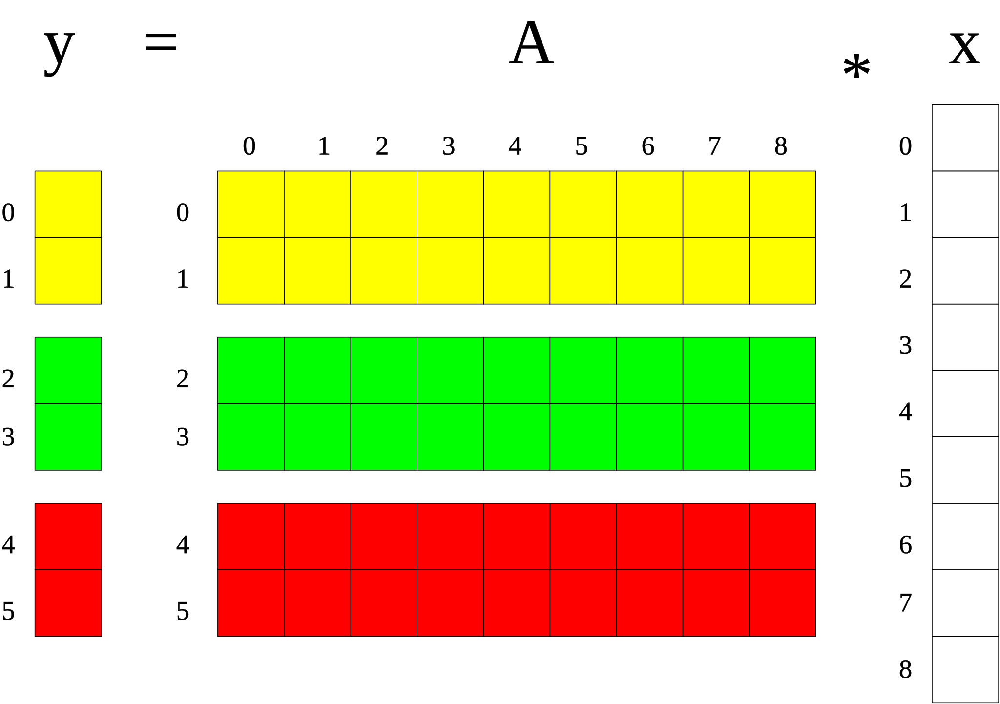

.. _lama_SparseVector:

SparseVector
============

While a dense vector stores all its values, a sparse vector stores only the non-zero values. In the latter case, an additional
array containing the indexes of the non-zero values is required, but the array containing the values might be significantly
smaller. 

Constructors
------------

In order to create a sparse vector you might call one of the constructors of the template class ``SparseVector``.
The most essential one is the following one:

.. code-block:: c++

    const IndexType size = ...;
    DistributionPtr blockDist =  blockDistribution( size );
    HArray<IndexType> localNonZeroIndexes = ...
    HArray<ValueType> localNonZeroValues  = ...
    ValueType zeroVal = 0;

    SparseVector<ValueType> vector( blockDist, localNonZeroIndexes, localNonZeroValues, zeroVal[, ctx] )

The zero element of a sparse vector is usually zero, but can be any arbitrary element.
The arrays with the local non-zero indexes and values must have the same size on each processor.
The non-zero indexes must already be local indexes regarding the distribution.

Like for the dense vectors, the context argument of a vector decides where operations on this vector will be executed. It
is optional, by default the context is the currently actual context (as specified by the environment
variable ``SCAI_CONTEXT``).

  
    Distributed Sparse Vector.

You might also create a replicated sparse vector, i.e. a full sparse vector that has an incarnation
on each processor. Therefore you can use the class ``NoDistribution`` for specifying the distribution,
or you might use the size argument directly instead of a distribution argument.

.. code-block:: c++

    const IndexType n = 1024;
    ValueType initVal = 1;
    HArray<ValueType> values = ...;
    SparseVector<ValueType> vector1( n, initVal[, ctx] );     // vector1( noDist, initVal )
    SparseVector<ValueType> vector2( n, nonZeroIndexes, nonZeroValues, zeroVal[, ctx] );

Free Functions with SparseVector Result
--------------------------------------

.. code-block:: c++

    const auto vector4 = sparseVectorRead( "matrix.frm" )

.. code-block:: c++

    template<typename ValueType>                  template<typename ValueType>
    SparseVector<ValueType> freeFunction( ... )   void subroutine( SparseVector<ValueType>& v, ... )
    {                                             {
        SparseVector<ValueType> v( ... );               v = ...;
        ...                                            ...
        return v;                                 }
    }

Vector Assembly
---------------

The template class VectorAssembly allows to assemble vector entries by different processors
independently. An element is added by its global index and the value at this position.

.. code-block:: c++

    VectorAssembly<ValueType> assembly;

    // each processor might push arbitrary matrix elements

    assembly.push( i1, val1 );
    ...
    assembly.push( i2, val2 );

    const IndexType n = ... ; // size of the vector

    auto dist = dmemo::blockDistribution>( n );

    auto sparseV = sparseVector<ValueType>( dist, 0 );
    sparseV.fillAssembly( assembly, common::BinaryOp::ADD );

- Zero elements might be filled explicitly to reserve memory in a sparse vector.
- Different modes are supported if entries are assembled twice, either by same or by different processors or for existing entries.
  In the REPLACE mode (default, common::binary::COPY) values will be replaced; different assembled values for the same entry
  might be undefined. In the SUM mode (common::BinaryOp::ADD) assembled values for the same position are added.
- An assembly can be used several times.

Even if the implementation of the assembling is highly optimized, it might involve a large amount of
communication as the assembled data must be communicated to their owners. Therefore it is always recommended
to due the assembling as locally as possible, i.e. elements should be inserted preferably by their owners.

Sparse Vector Methods
--------------------

SparseVector is a derived class from the generic class ``Vector``, so all methods and 
operations provided by this class are also available for the ``SparseVector`` class.

DenseVector or SparseVector
---------------------------

The following differences between a dense and a sparse vector should be kept in mind:

* There is no method to set individually a single element in sparse vector, while a dense vector has the method ``setValue``.
* gather and scatter operations are only supported for dense vectors
* sorting, FFT is only supported for dense vectors

Here are some typical situtations where an application might benefit from a sparse vector:

- getRow or getColumn of a sparse matrix is faster if the result is stored in a sparse vector

.. code-block:: c++

   CSRSparseMatrix<ValueType> sparseM;
   SparseVector<ValueType> sparseV;
   DenseVector<ValueType> denseV;

   sparseM.getRow( sparseV, i );
   sparseM.getRow( denseV, i );

- some binary operations with a dense and a sparse vector are faster, as shown in the following code

.. code-block:: c++

   SparseVector<ValueType> sparseV = ...
   DenseVector<ValueType> denseV = ...

   ValueType s = sparseV.dotProduct( denseV );
   ValueType s = denseV.dotProduct( sparseV );
   denseV += alpha * sparseV;
   denseV -= alpha * sparseV;
   denseV *= sparseV1;          // sparseV1 has zero element 1

Binary operations with two sparse vectors (if not the same) require some overhead to determine the new pattern
for the non-zero elements.

.. code-block:: c++

   _SparseVector& sparseV1 = ...
   _SparseVector& sparseV2 = ...
   
   Scalar s = sparseV1.dotProduct( sparseV2 );
   sparseV1 += sparseV2;

Good Practice Advices
---------------------

A sparse vector is also not a container class where elements can easily be added or removed. Therfore the
VectorAssembly class or other C++ container classes should be used, and a LAMA sparse vector should only be 
generated by the final data.

