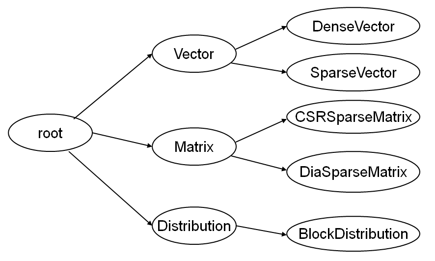

Integration
-----------

To integrate the logging-framework into a software a set of macros is provided. Each macro starts with
the prefix SCAI_LOG to indicate that it is used for logging. 

Global definition, configuration and initialization of the logging system is not necessary.
It is done implicitly when the first logging statement is used.

There is an include file that contains the definitions for all the macros:

.. code-block:: c++

    #include <scai/logging.hpp>

Instantiation
^^^^^^^^^^^^^

In the different subroutines and modules it is possible to get access to a logger. The macro SCAI_LOG_DEF_LOGGER
defines a static logger variable with a certain name. 

.. code-block:: c++

    SCAI_LOG_DEF_LOGGER( Vector::logger, "Vector" ); 
    SCAI_LOG_DEF_LOGGER( CSRMatrix::logger, "Matrix.CSR" );
    SCAI_LOG_DEF_LOGGER( ELLMatrix::logger, "Matrix.ELL" );
    
Furthermore, for template classes:

.. code-block:: c++

    SCAI_LOG_DEF_TEMPLATE_LOGGER( template<typename T>, SparseMatrix<T>::logger, "Matrix.SparseMatrix" )
    
    
Logging-Statements
^^^^^^^^^^^^^^^^^^

A logger is used in the following macros that stand for the logging statements at the different levels. The
variable logger must have been defined with one of the two previous macros:

.. code-block:: c++

    SCAI_LOG_TRACE( logger, "trace message" );
    SCAI_LOG_DEBUG( logger, "debug message" );
    SCAI_LOG_INFO ( logger, "info message" );
    SCAI_LOG_WARN ( logger, "warn message" );
    SCAI_LOG_ERROR( logger, "error message" );
    SCAI_LOG_FATAL( logger, "fatal message" );

The following logging levels are supported:

- TRACE is even more detailed than DEBUG and 
- DEBUG designates fine-grained informational events that are most useful to debug an application
- INFO  is for informational messages that highlight the progress of the application at coarse-grained 
  level and should be used when a protocol of the application is required.
- WARN designates potentially harmful situations
- ERROR is for error events that might still allow the application to continue running.
- FATAL designates severe error events that will presumably lead the application to abort.

Multiple different output arguments can be combined with the << operator in the
message argument of the logging statements. It is the same mechanism as used for
C++ streams, i.e. the << operator must be defined for the corresponding argument.

.. code-block:: c++

    SCAI_LOG_DEBUG( logger, "loop iteration " << i " of " << n );

The general idea is that the logging should appear in the source code but logging is usually disabled at
runtime especially for the lower levels (DEBUG, INFO).
Logging macros have nearly no overhead if the logging is disabled at runtime,
as it is only an integer comparison with a static variable. 

Logger-Hierarchy
^^^^^^^^^^^^^^^^

Loggers can be structured hierarchically. Each dot in the name gives a new hierarchy,
The hierarchy of the loggers makes it more comfortable to configure the loggers.

.. code-block:: c++

    SCAI_LOG_DEF_LOGGER( Vector::logger, "Vector" )
    SCAI_LOG_DEF_LOGGER( DenseVector::logger, "Vector.DenseVector" )
    SCAI_LOG_DEF_LOGGER( SparseVector::logger, "Vector.SparseVector" )
    SCAI_LOG_DEF_LOGGER( Matrix::logger, "Matrix" )
    SCAI_LOG_DEF_LOGGER( CSRSparseMatrix::logger, "Matrix.CSRSparseMatrix" )
    SCAI_LOG_DEF_LOGGER( DIASparseMatrix::logger, "Matrix.DIASparseMatrix" )
    SCAI_LOG_DEF_LOGGER( Distribution::logger, "Distribution" )
    SCAI_LOG_DEF_LOGGER( BlockDistribution::logger, "Distribution.BlockDistribution" )

These definitions of the loggers result in the following hierarchy:

    

Use of logging for C++ classes
^^^^^^^^^^^^^^^^^^^^^^^^^^^^^^

Usually, each C++ class should have its own logger that is used within the methods of the class. 
The logger becomes a static variable of the class.

.. code-block:: c++

   #include "scai/logging.hpp"
   
   class Example
   {
       ...
   protected: 
       SCAI_LOG_DECL_STATIC_LOGGER( logger )
       ...
   }

   template<typename T>
   class SparseMatrix
   {
   protected: 
       SCAI_LOG_DECL_STATIC_LOGGER( logger )
       ...
   }

As the logger is a static variable,
it is not possible to set logging levels individually for objects of the class. This seemed to be nice
but has two major problems. The first one is an efficiency reason as each construction of an object requires
not very cheap access to the logger in the logger hierarchy. The second one is that the  configuration of
loggers for individual objects is not practical as objects have no individual names.

A logger should not be declared as public so the logger can be used only inside the class. 
Derived classes should usually have their own logger, in this case
the logger should become private. The logger should be protected in situatons  where it is 
useful that the logger can also be used in derived classes.

In the implementation of the class, e.g. Example.cpp, the logger has to be defined as follows:

.. code-block:: c++

    SCAI_LOG_DEF_LOGGER( Example::logger, "Example" )
    SCAI_LOG_DEF_TEMPLATE_LOGGER( template <typename T>, SparseMatrix<T>::logger, "Matrix.SparseMatrix" )
   