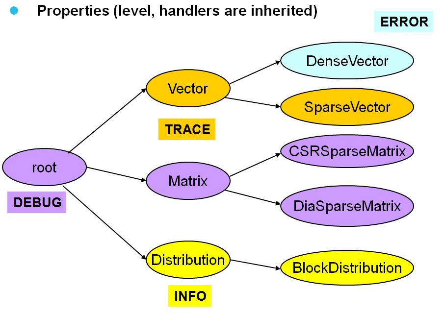

Runtime-Configuration
---------------------

Global-Definition
^^^^^^^^^^^^^^^^^

Logging can be configured at runtime by setting the environment variable ``SCAI_LOG`` with a logging level.

.. code-block:: bash

    export SCAI_LOG=TRACE 
    export SCAI_LOG=DEBUG
    export SCAI_LOG=INFO
    export SCAI_LOG=WARN
    export SCAI_LOG=ERROR
    export SCAI_LOG=OFF

Config-Definition
^^^^^^^^^^^^^^^^^

For setting loggers invididually, a configuration file can be used whose name should be different to 
the logging levels.

.. code-block:: bash

    export SCAI_LOG=<config_file>

The configuration file should contain lines that specfy the levels of the logger.

.. code-block:: c++

    <root> = DEBUG
    Vector = TRACE
    Vector.DenseVector = ERROR
    Distribution = INFO

The default configuration for all loggers is level *WARN* if no configuration file is specified or if no
level has been specified in the configuration file. The RootLogger can be referenced by **<root>**.

If the environment variable ``SCAI_LOG`` is not set, a logging file with the name .loggingrc is searched 
in the home directory of the user. If this file is also not available, the default configuration is chosen.

For Debugging purposes it is also possible to flush the output of the logger, so all logging messages are
displayed even if the program crashes. Flushing can be activated by the config file:

.. code-block:: c++

    flush = true

Output
^^^^^^

The default output format of logging messages is as follows:

.. code-block:: c++

    #date, #time #name @ #thread ( #func -> #file::#line ) #level #msg

where the tokens starting with # have the following meanings:

- ``#date`` stands for the current date, e.g. 2015-07-26 (yyyy-mm-dd)
- ``#time`` stands for the time of the output, e.g. 13:21:22 (hh:mm:ss)
- ``#name`` stands for the full name of the logger
- ``#func`` stands for the function in which the logging has been called
- ``#file`` is the file contaning the logging macro
- ``#line`` is the line number in the file with the actual logging statement
- ``#level`` is the logging level (e.g. INFO or WARN)
- ``#msg`` is the output message of the logging statement

It is possible to change this default output format by a line in the config file, e.g.:

.. code-block:: c++

    format = "logger = #name, msg: #msg"

The output format cannot be redefined individually for different loggers and the format string is not allowed to be
empty.

Other tokens starting with a ``#`` will be handled as follows:

- ``#stack`` will print the call stack at the time when  the logging is done
- ``#<var>`` any other value will print the corresponding environment variable.

Printing the stack might be especially helpful for warnings as it helps to identify
the reason for the warning.

Printing an environment variable is very useful to print important values set by certain routines
in the program. E.g. in LAMA it might be used for communicators; there the
MPI communicator will set the variable ``SCAI_COMM`` or ``SCAI_RANK`` and so these variables
help to identify which processor printed the statement.