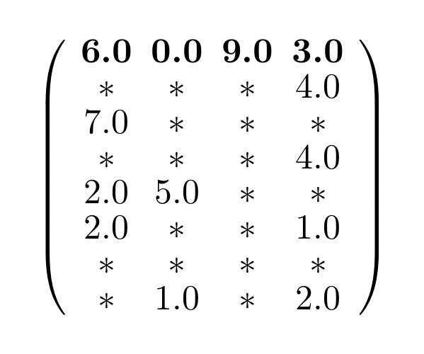
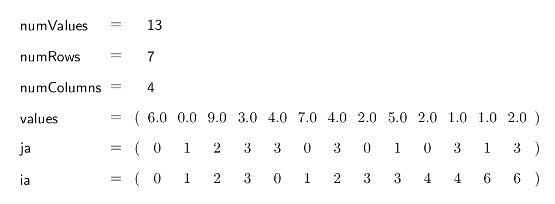
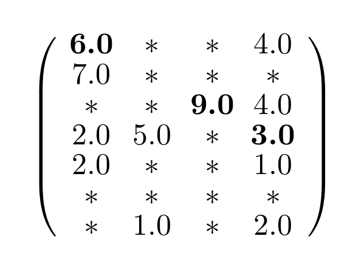
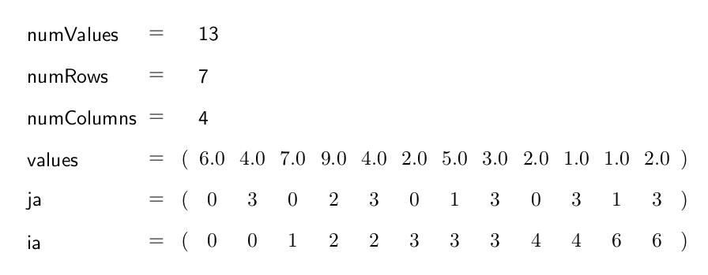

.. _sparsekernel_COO:

Coordinate Storage Format (COO)
===============================

The COO format is a very simple format. In one array, all the row indices for each value are stored (ia), in another
all the column indices (ja) and a third array saves the desired values (values). Logically the arrays all have a
length of *numValues*. 

If the diagonal element shifting is activated, all main diagonal elements are shifted to the beginning of the arrays.
The other elements might be sorted row-wise or column-wise to optimize the access to the values of one row or one
column.

Example
-------

Matrix:

.. image:: _images/Storage.png
    :align: center
    :width: 200px

With diagonal element shifting
^^^^^^^^^^^^^^^^^^^^^^^^^^^^^^
    
The COO format with diagonal element shifting for the example matrix looks like this:

    

    
Without diagonal element shifting
^^^^^^^^^^^^^^^^^^^^^^^^^^^^^^^^^
    
The COO format without diagonal element shifting for the example matrix looks like this:

    

    

COOKernelTrait
--------------

The COOKernelTrait contains various function which operates on the introduced COO-format. 
These functions are grouped into conversion, caculation und properties. The following tables show 
which function has been implemented on which back-end.

Conversion
^^^^^^^^^^

====================== ============================================================= ==== ====
**Functionname**       **Description**                                               Host CUDA
====================== ============================================================= ==== ====
offsets2ia             CSR --> COO: converting offset array (CSR) to ia array (COO)  *    *
getCSRValues           COO --> CSR: conversion COO to CSR                            *
setCSRData             CSR --> COO: conversion CSR to COO                            *    *
====================== ============================================================= ==== ====

Calculation
^^^^^^^^^^^

====================== ============================================================= ==== ====
**Functionname**       **Description**                                               Host CUDA
====================== ============================================================= ==== ====
scaleRows              multiplies each row with an own value                         *
normalGEMV             matrix-vector multiplication                                  *    *
normalGEVM             vector-matrix multiplication                                  *    *
jacobi                 compute one jacobi iteration step                             *
jacobiHalo             compute one jacobi iteration step on halo values
====================== ============================================================= ==== ====

Properties
^^^^^^^^^^

====================== ============================================================= ==== ====
**Functionname**       **Description**                                               Host CUDA
====================== ============================================================= ==== ====
hasDiagonalProperty    Checks if the first n entries are the diagonal elements       *
====================== ============================================================= ==== ====

