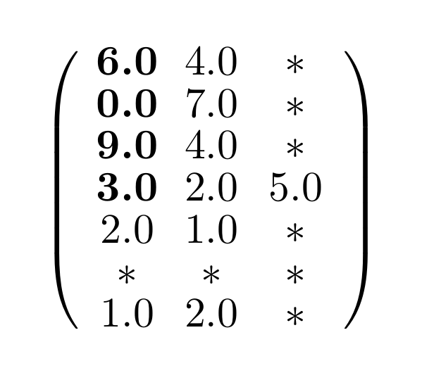
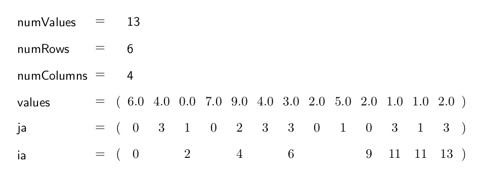
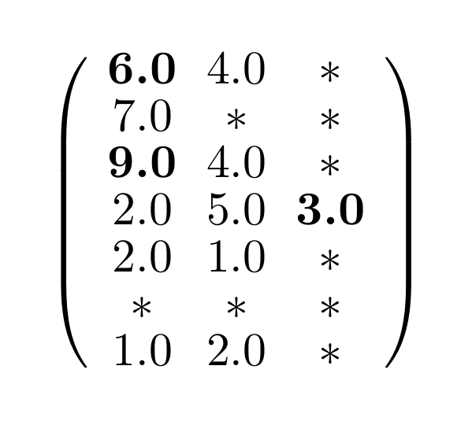
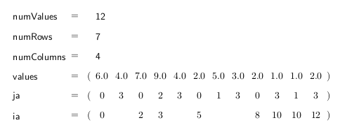

.. _sparsekernel_CSR:

Compressed Sparse Row Format (CSR)
==================================

In the CSR format all non-zero-elements are shifted to the left. If the option for shifting the main diagonal to the
front is set to true, the main diagonal elements will stand in the very beginning of each row. Zeroes that are off
the main diagonal are ignored in any case. The CSR saves the number of the saved elements (non-zero-elements plus the
number of zeroes on the main diagonal, if the option is set) (numValues), the number of rows of the matrix (numRows),
the number of columns in the original non-compressed format (numColumns) and arrays for all the non-zero-values and
zeroes in the main diagonal (values), the associated columns for these elements (ja) and the indices of the new
beginnings of a row in *values* as well as the value of *numValues* at the very end (ia).

Example
-------

Matrix:

.. image:: _images/Storage.png
    :align: center
    :width: 200px
    
With diagonal element shifting
^^^^^^^^^^^^^^^^^^^^^^^^^^^^^^

The CSR format with diagonal element shifting for the example matrix looks like this:

    

    
Without diagonal element shifting
^^^^^^^^^^^^^^^^^^^^^^^^^^^^^^^^^
    
The CSR format without diagonal element shifting looks like this:

    

CSRKernelTrait
--------------

The CSRKernelTrait contains various function which operates on the introduced CSR-format. 
These functions are grouped into conversion, caculation und properties. For the CSR-format
we offer the most functionality compared to the other formats. The following tables show 
which function has been implemented on which back-end.

Conversion
^^^^^^^^^^

====================== ============================================================= ==== ====
**Functionname**       **Description**                                               Host CUDA
====================== ============================================================= ==== ====
sortRowElements        sorts the elements of a row by increasing column indexes      *
sizes2offsets          computes offset array from sizes array                        *    *
offsets2sizes          computes sizes array from offset array                        *    *
convertCSR2CSC         converts from CSR2CSC                                         *    *
compress               fill compresses CSR data in new data structures               *
====================== ============================================================= ==== ====

Calculation
^^^^^^^^^^^

====================== ============================================================= ==== ====
**Functionname**       **Description**                                               Host CUDA
====================== ============================================================= ==== ====
jacobi                 compute one jacobi iteration step                             *    *
jacobiHalo             compute one jacobi iteration step on halo values              *    *
matrixAddSizes         computes row sizes for result of matrix addition              *    *
matrixMultiplySizes    computes row sizes for result of matrix multiplication        *    *
matrixMultiplyJA       computes column indexes for result of matrix multiplication   *
scaleRows              multiplies each row with an own value                         *    *
absMaxDiffVal          computes the maximal element-wise difference for two matrices *
normalGEMV             matrix-vector multiplication                                  *    *
normalGEVM             vector-matrix multiplication                                  *    *
sparseGEMV             matrix-vector multiplication with just non-zero rows          *    *
sparseGEVM             vector-matrix multiplication with just non-zero rows          *    *
gemm                   matrix-matrix multiplication (CSR * Dense)                    *
matrixAdd              matrix-matrix addition (all CSR)                              *    *
matrixMultiply         matrix-matrix multiplication  (all CSR)                       *    *
====================== ============================================================= ==== ====

Properties
^^^^^^^^^^

====================== ============================================================= ==== ====
**Functionname**       **Description**                                               Host CUDA
====================== ============================================================= ==== ====
validOffsets           checks for legal offset array                                 *
hasDiagonalProperty    checks if CSR data has diagonal property                      *    *
countNonZeros          count non-zero entries                                        *
====================== ============================================================= ==== ====

