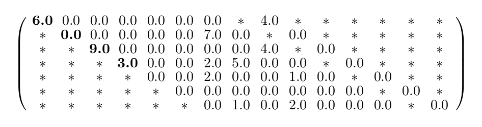
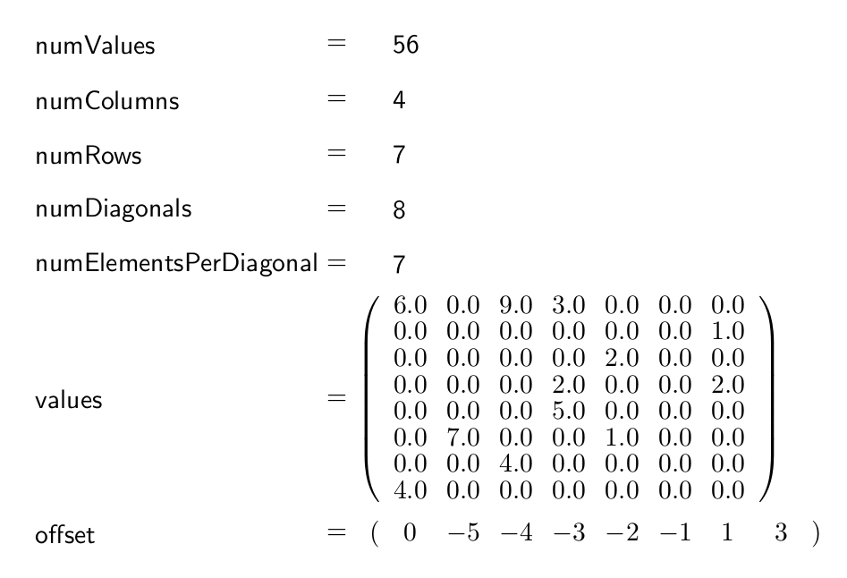
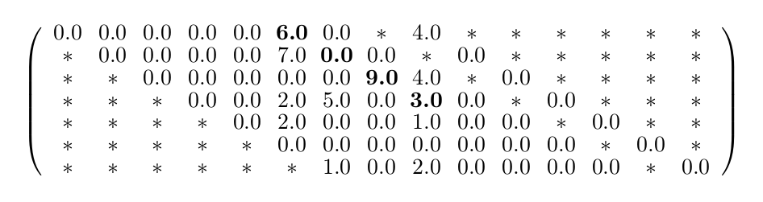

.. _sparsekernel_DIA:

Diagonal Storage Format (DIA)
=============================

The DIA format keeps the matrix in order, but extends every diagonal of
the matrix, that contains a non-zero-element. The other diagonals are ignored completely. The extension is done by
adding zeroes "outside" the matrix until all diagonals have the same specific length (numElementsPerDiagonal). This
specific length is either the number of rows (numRows) or the number of columns (numColumns) and depends on which of
these two integer holds the larger value. The number of diagonals is saved as well (numDiagonals) and the total number
of values (including the added zeroes, excluding the zeroes that were "deleted" in order to ignore the unnecessary
diagonals) is calculated like this: *numValues* = *numDiagonals* * *numElementsPerDiagonal*. All the elements
are stored in diagonal major order in an array (values) and another array shows the offset of the main diagonal
(offset). Negative values in the offset array represent diagonals "below" the main diagonal (its original position),
positive values represent diagonals "above" or "right" from the main diagonal.

Example
-------

Matrix:

.. image:: _images/Storage.png
    :align: center
    :width: 200px
    
With diagonal element shifting
^^^^^^^^^^^^^^^^^^^^^^^^^^^^^^

The DIA format with diagonal element shifting for the example matrix looks like this:

    

    
Without diagonal element shifting
^^^^^^^^^^^^^^^^^^^^^^^^^^^^^^^^^
    
The DIA format without diagonal element shifting looks like this:

    

DIAKernelTrait
--------------

Conversion
^^^^^^^^^^

========================= ============================================================= ==== ====
**Functionname**          **Description**                                               Host CUDA
========================= ============================================================= ==== ====
getCSRSizes               DIA --> CSR: get sparse row sizes                             *
getCSRValues              DIA --> CSR: conversion DIA to CSR                            *
========================= ============================================================= ==== ====

Calculation
^^^^^^^^^^^

========================= ============================================================= ==== ====
**Functionname**          **Description**                                               Host CUDA
========================= ============================================================= ==== ====
normalGEMV                matrix-vector multiplication                                  *    *
normalGEVM                vector-matrix multiplication                                  *    *
jacobi                    compute one jacobi iteration step                             *
absMaxVal                 compute the maximal absolute value                            *
========================= ============================================================= ==== ====

