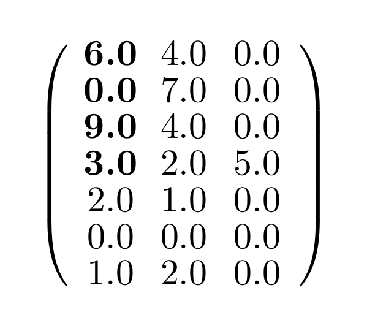
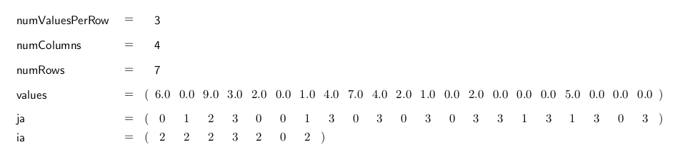
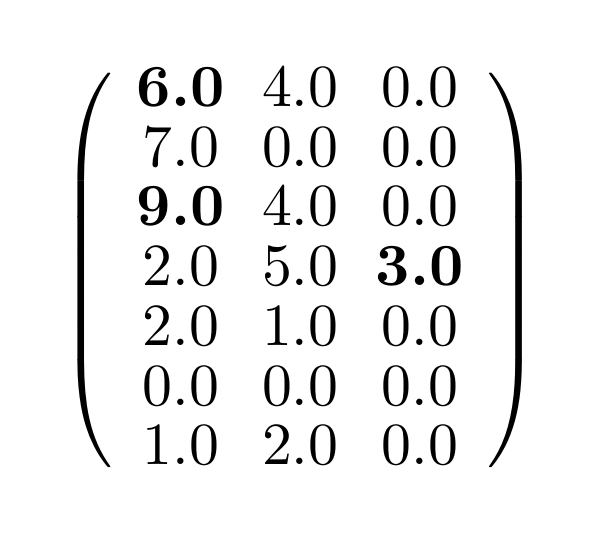
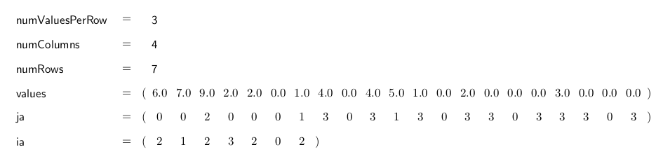

.. _sparsekernel_ELL:

ELLPACK-R Storage Format (ELL)
==============================

The ELL format is much like the CSR format, though the compressed matrix is filled with zeroes to obtain a "shortened"
version of the original. The ELL matrix saves the number of rows it (and the original matrix) have (numRows), the
number of columns the ELL format has which is equal to the length of its longest rows (numValuesPerRow), the original
number of columns (numColumns). The total number of values, including the zeroes that are used as a filler, can be
calculated with *numRows* * *numValuesPerRow*. Additionally the ELL format saves three arrays as well, one for
all the values in the ELL matrix, which are stored in column major order (values), one for the number of non-zero
values (plus the main diagonal zeroes, if needed) (ia) and one for their associated columns (ja). In case of the
"filler"-zeroes, ja points at the last element's column of this row.

The ELL format is used for matrices with about equivalent numbers of non-zero-values in each row.

Example
-------

Matrix:

.. image:: _images/Storage.png
    :align: center
    :width: 200px
    
With diagonal element shifting
^^^^^^^^^^^^^^^^^^^^^^^^^^^^^^

The ELL format with diagonal element shifting for the example matrix looks like this:

    

    
Without diagonal element shifting
^^^^^^^^^^^^^^^^^^^^^^^^^^^^^^^^^
    
The ELL format without diagonal element shifting looks like this:

    

ELLKernelTrait
--------------

Conversion
^^^^^^^^^^

========================= ============================================================= ==== ====
**Functionname**          **Description**                                               Host CUDA
========================= ============================================================= ==== ====
fillELLValues             fill up ja and values array                                   *    *
getCSRValues              ELL --> CSR: conversion ELL to CSR                            *    *
setCSRValues              CSR --> ELL: conversion CSR to ELL                            *    *
compressIA                compress the ia array by using values array and epsilon       *
compressValues            compress ja and values array by using epsilon                 *
getRow                    returns a row of the matrix                                   *    *
getValue                  get single element of matrix                                  *    *
countNonEmptyRowsBySizes  count non-empty rows by sizes array                           *    *
setNonEmptyRowsBySizes    set non-empty rows by sizes array                             *    *
========================= ============================================================= ==== ====

Calculation
^^^^^^^^^^^

========================= ============================================================= ==== ====
**Functionname**          **Description**                                               Host CUDA
========================= ============================================================= ==== ====
jacobi                    compute one jacobi iteration step                             *    *
jacobiHalo                compute one jacobi iteration step on halo values              *    *
normalGEMV                matrix-vector multiplication                                  *    *
sparseGEMV                matrix-vector multiplication with just non-zero rows          *    *
normalGEVM                vector-matrix multiplication                                  *    *
sparseGEVM                vector-matrix multiplication with just non-zero rows          *    *
absMaxVal                 compute the maximal absolute value                            *
scaleValue                scale with array                                              *    *
matrixMultiplySizes       computes row sizes for result of matrix multiplication        *
matrixAddSizes            computes row sizes for result of matrix addition              *
matrixAdd                 matrix-matrix addition (all ELL)                              *
matrixMultiply            matrix-matrix multiplication  (all ELL)                       *
========================= ============================================================= ==== ====

Properties
^^^^^^^^^^

========================= ============================================================= ==== ====
**Functionname**          **Description**                                               Host CUDA
========================= ============================================================= ==== ====
hasDiagonalProperty       Checks if the first n entries are the diagonal elements       *    *
check                     Checks integrity of ia array                                  *    *
========================= ============================================================= ==== ====

