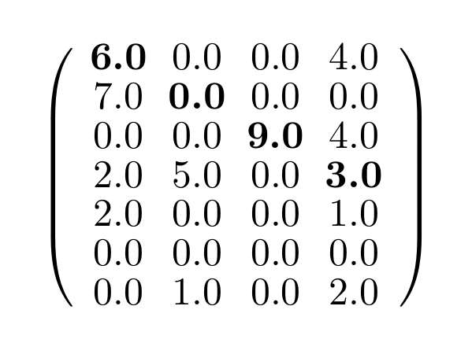
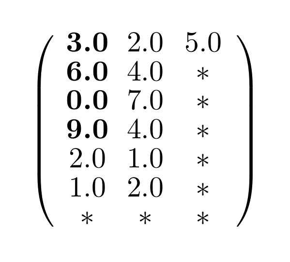
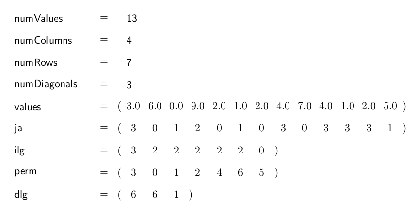
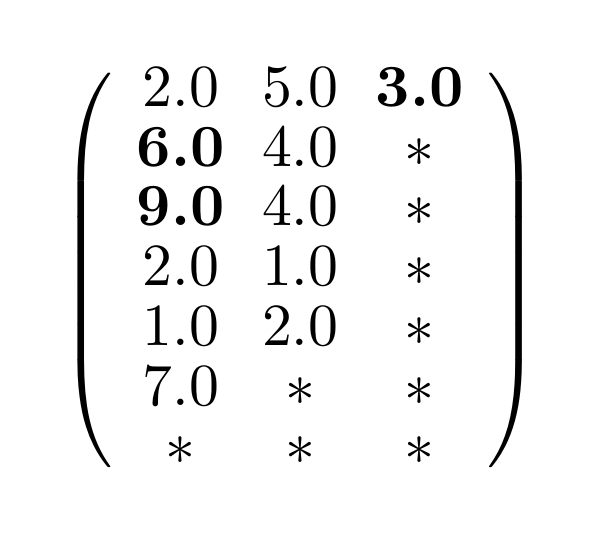
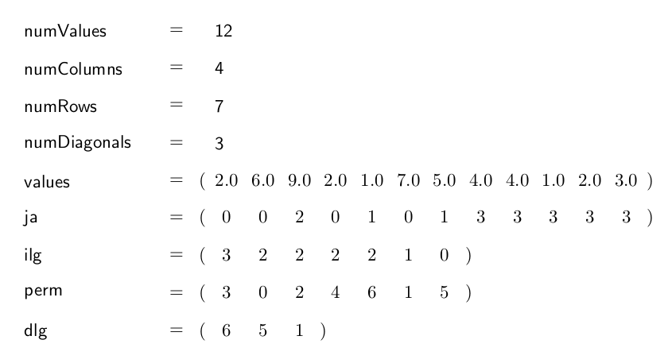

.. _sparsekernel_JDS:

Jagged Diagonal Storage Format (JDS)
====================================

The JDS format shifts all the non-zero-elements to the very left. Afterwards
it sorts the rows by length, so the longest row stands on top of the matrix and the shortest at the bottom. Like the
ELL matrix the elements in the *values*-array are entered in column major order. The JDS comes with the integer
*numValues*, *numRows*, *numColumns* and the number of jagged diagonals (which is equal to the number of
columns in the "jagged" Matrix): *numDiagonals*. It contains 5 arrays: One array for the length of each column
(dlg) and one for the length of each row (ilg), the permutation array which shows, where the lines were supposed to
be before the assorting (perm) and the arrays for the elements (values) and their original column indices (ja) as in
the CSR and ELL format.

Example
-------

Matrix:

    
With diagonal element shifting
^^^^^^^^^^^^^^^^^^^^^^^^^^^^^^

The JDS format with diagonal element shifting for the example matrix looks like this:

    

    
Without diagonal element shifting
^^^^^^^^^^^^^^^^^^^^^^^^^^^^^^^^^
    
The JDS format without diagonal element shifting looks like this:

    

JDSKernelTrait
--------------

Conversion
^^^^^^^^^^

========================= ============================================================= ==== ====
**Functionname**          **Description**                                               Host CUDA
========================= ============================================================= ==== ====
sortRows                  sorting of values in descending order                         *    *
setInversePerm            compute inverse permutation for a given permutation           *    *
ilg2dlg                   compute dlg array from ilg array                              *    *
getCSRValues              JDS --> CSR: conversion JDS to CSR                            *    *
setCSRValues              CSR --> JDS: conversion CSR to JDS                            *    *
getRow                    returns a row of the matrix                                   *    *
getValue                  get single element of matrix                                  *    *
========================= ============================================================= ==== ====

Calculation
^^^^^^^^^^^

========================= ============================================================= ==== ====
**Functionname**          **Description**                                               Host CUDA
========================= ============================================================= ==== ====
jacobi                    compute one jacobi iteration step                             *    *
jacobiHalo                compute one jacobi iteration step on halo values              *    *
normalGEMV                matrix-vector multiplication                                  *    *
normalGEVM                vector-matrix multiplication                                  *    *
scaleValue                scale with array                                              *    *
========================= ============================================================= ==== ====

Properties
^^^^^^^^^^

========================= ============================================================= ==== ====
**Functionname**          **Description**                                               Host CUDA
========================= ============================================================= ==== ====
checkDiagonalProperty     Checks if the first n entries are the diagonal elements       *    *
========================= ============================================================= ==== ====
