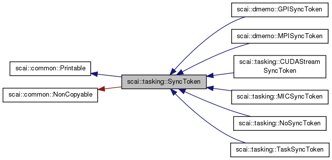
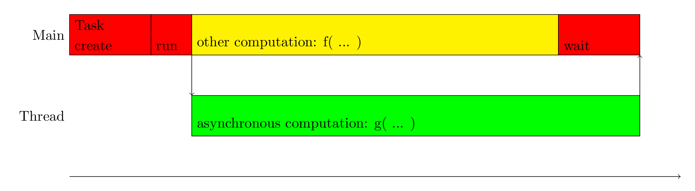

.. _main-page_tasking:

############
SCAI Tasking
############

***********
Description 
***********

Tasking is a library that provides support for all kind of asynchronous executions:

* asynchronous computations on different context devices
* asynchronous memory transfer, either in one memory class but also between different memory classes
* asynchronous communication 

It provides the SyncToken class as the central concept for synchronization. An object of this class
hides the context wherever the asynchronous execution has started and its destructor frees 
all occupied resources.

*************************
Tasking Library Reference
*************************

For using this library the base class ``SyncToken`` is needed as well as the derived
classes to start asynchronous executions.

Picture shows the class diagram.

===========================  =========================================================
Class                        Description
===========================  =========================================================
:ref:`SyncToken`             Common base class for all asynchronous operations
:ref:`NoSyncToken`           Pseudo class for synchronous execution
:ref:`TaskSyncToken`         Asynchronous execution of a task by a Host thread
:ref:`CUDAStreamSyncToken`   Asynchronous execution of a CUDA kernel on a GPU device
MPISyncToken                 Asynchronous execution of a MPI communication.
===========================  =========================================================

The design of this library is done in such a way that other libraries can define 
their own derived classes for asynchronous executions. So the class MPISyncToken
is not part of this library but part of the library dmemo.

Internally, some helper classes are used to faciliate the use and to decrease
the overhead of asynchronous executions.

===========================  =========================================================
Class                        Description
===========================  =========================================================
:ref:`ThreadPool`            Thread pool avoids overhead due to thread creation
:ref:`Task`                  Helper class that describes a task executed in a thread pool
:ref:`CUDAStreamPool`        Management of streams on a CUDA device
===========================  =========================================================

.. toctree::
   :hidden:

   SyncToken
   NoSyncToken
   TaskSyncToken
   CUDAStreamSyncToken

   ThreadPool
   Task
   CUDAStreamPool

*******
Example
*******

The following example shows how the main program can start a thread that executes
a certain function g while the main thread itself executes another function f.

.. code-block:: c++

    #include <scai/tasking/Task.hpp>

    using namespace scai;

    void f() { ... }
    void g() { ... }

    {
        tasking::Task t1( g );
        f();
        t1.wait();
    }

*********************
Environment Variables
*********************

The number of threads available in the thread pool can be configured by this
environmnent variable.

* ``SCAI_THREADPOOL_SIZE`` (integer value)

************
Dependencies
************

Internal dependencies:

* :ref:`SCAI Common<scaicommon:main-page_common>`
* :ref:`SCAI Logging<scailogging:main-page_logging>`
* :ref:`SCAI Tracing<scaitracing:main-page_tracing>`

************
Related Work
************

Thread pools are not provided by the C++ 11 standard, but by the Boost task library. 
