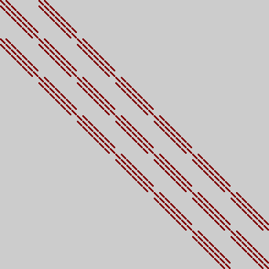

.. _LamaSpy:

*******
lamaSpy
*******

.. code-block:: c++

   lamaSpy matrix_filename bitmap_filename [ width [ height ] ]

Example:

.. code-block:: c++
   
   lamaGenStencilMatrix stencil.mtx 3 27 7 7 7 
   lamaSpy stencil.mtx stencil3D_27_7.png

This is the generated image:

    Sparsity of a stencil matrix that stands for 27-point stencil on a 7 x 7 x 7 grid

For very large matrices it is recommended to specify the sizes of the generated image explicitly.

.. code-block:: c++
   
   lamaSpy audikw_1.mtx audikw_1.png 512 512

    Sparsity pattern of audikw_1 (taken from SuiteSparse Matrix Collection)

The format of the generated image is chosen by the suffix of the filename for the generated image.

* bmp stands for uncompress bitmap file, is always supported
* png stands for the PNG format and is only supported if a libpng was available during installation.
* other formats might be supported in future or by adding own image writers.

