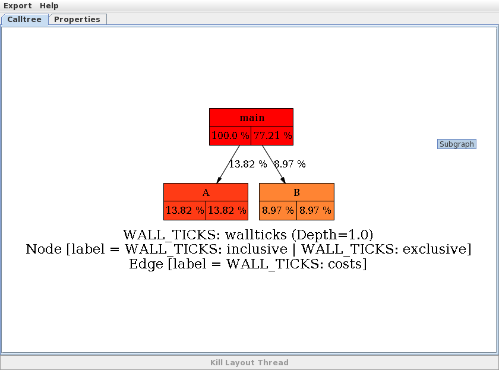
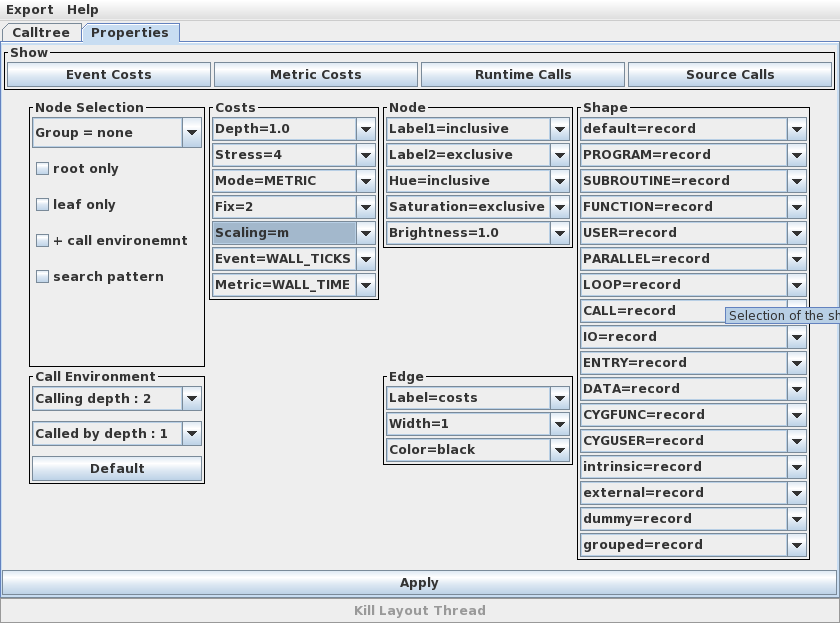
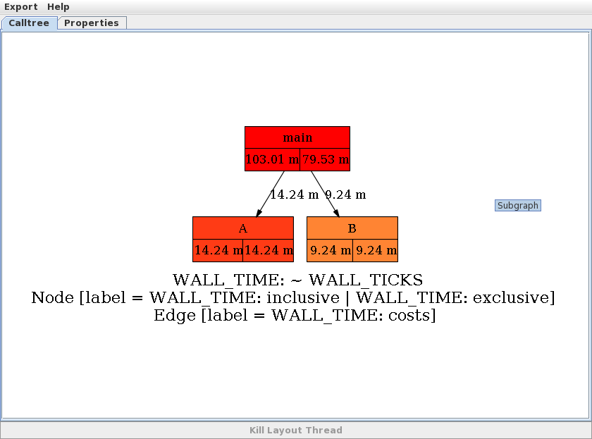
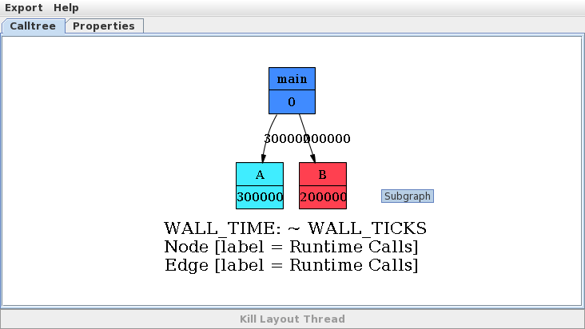

Example
=======

The following example shows a C++ program where the main program and the two subroutines have been
instrumented.

.. literalinclude:: ../examples/TraceCalls.cpp

::

   export SCAI_TRACE=ct
   ./TraceCalls
   $HOME/local/scai/bin/TraceCT TraceCalls.ct

In the callgraph each node stands for a region and an edge from region_1 to region_2 
indicates that region_2 has been called at least once from region_1.
In the first image, the nodes and edges are labeled with the time spent in the different regions.
The values are relative, i.e. range from 0 to 100%. The left value in a node is the inclusive
time and the right value is the exclusive time. This is for leaf nodes always the same. For the main
program the inclusive time is always 100%, but in the routine only 77.21% of the time has been 
spent. The other time has been spent in the routines A and B. All exclusive times sum always up
to 100% ( 77.21 + 13.82 + 13.97 = 100 ).

The property window allows to set many options for the output image. Now we select
MetricCosts, where ticks are scaled to milliseconds.

After pushing the Apply buttion a new image is generated.

Runtime calls show how often a subroutine has been called.

